# BTClock v4 architecture (UML)

Diagrams render natively on Forgejo / GitHub via Mermaid. Each section
maps to a real subsystem: file paths in the captions are the source of
truth — if a diagram drifts from the code, trust the code.

Conventions:
- **Class** boxes name the C++ class as it appears in source.
- **Owns** = `unique_ptr` / `optional` / by-value member.
- **Refs** = raw pointer / reference, lifetime managed elsewhere.
- **Calls** = method invocation, no ownership.

---

## 1. Component overview

Top-level subsystems and the wires between them. `AppCtx`
([main/app/app_ctx.hpp](../main/app/app_ctx.hpp)) is the runtime root —
everything else hangs off it.

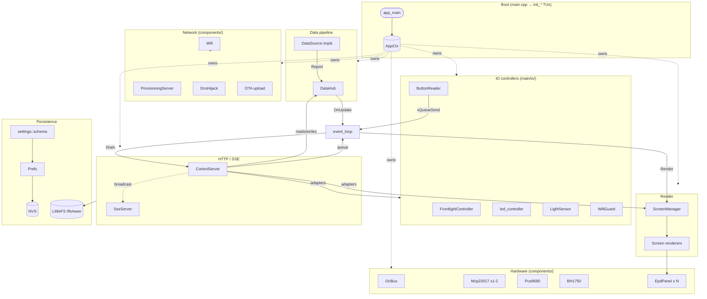

---

## 2. AppCtx ownership (class diagram)

`AppCtx` is behaviour-free — a struct of subsystem handles populated by
the `init_*` TUs in [main/app/boot/](../main/app/boot/). Composition
arrows point from owner to owned.

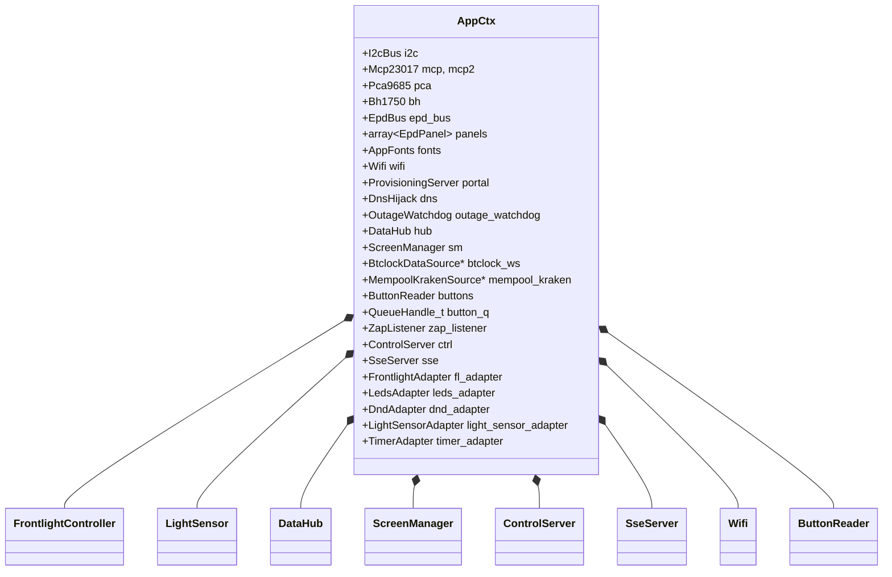

---

## 3. Data pipeline (class diagram)

Pure-virtual `DataSource`
([components/data_core/include/data_core/source.hpp:23](../components/data_core/include/data_core/source.hpp#L23))
is the contract; `DataHub` ([hub.hpp](../components/data_core/include/data_core/hub.hpp))
fan-ins reports under a mutex and fires an `UpdateCallback`.

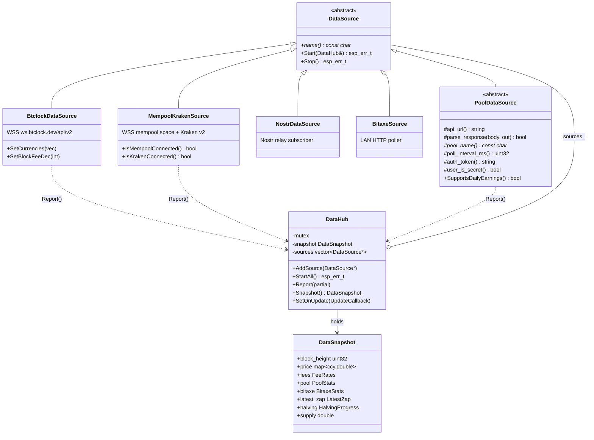

---

## 4. Mining-pool plugins (class diagram)

Every `mining_pool_*` component subclasses `PoolDataSource`
([components/mining_pool_common/include/mining_pool_common/pool_base.hpp:41](../components/mining_pool_common/include/mining_pool_common/pool_base.hpp#L41)).
Two pools (ViaBTC, Foundry) inherit through an intermediate
`KeyedGetPoolBase` that swaps the auth header to `X-API-KEY`.

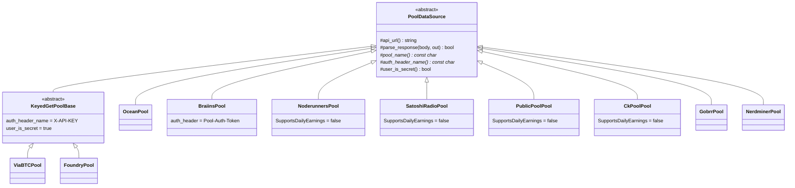

---

## 5. ScreenManager + renderers (class diagram)

`ScreenManager` ([main/app/screen_manager.hpp:51](../main/app/screen_manager.hpp#L51))
owns the slot index, refresh policy, rotation timer, and last-rendered
diff state. Renderers are free template functions in
[main/screens/](../main/screens/) — there is no Screen base class.

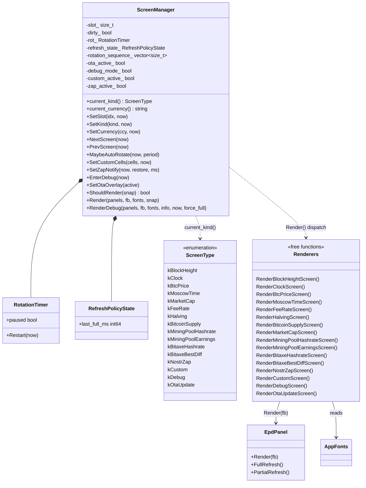

---

## 6. ControlServer + adapter interfaces (class diagram)

`ControlServer` ([components/webserver/include/control_server.hpp](../components/webserver/include/control_server.hpp))
talks to `main/` only through pure-virtual `*Iface` interfaces so the
webserver component never has to include `main/`. `main.cpp` instantiates
adapter structs in [main/app/boot/adapters.hpp](../main/app/boot/adapters.hpp)
that forward to the real subsystems.

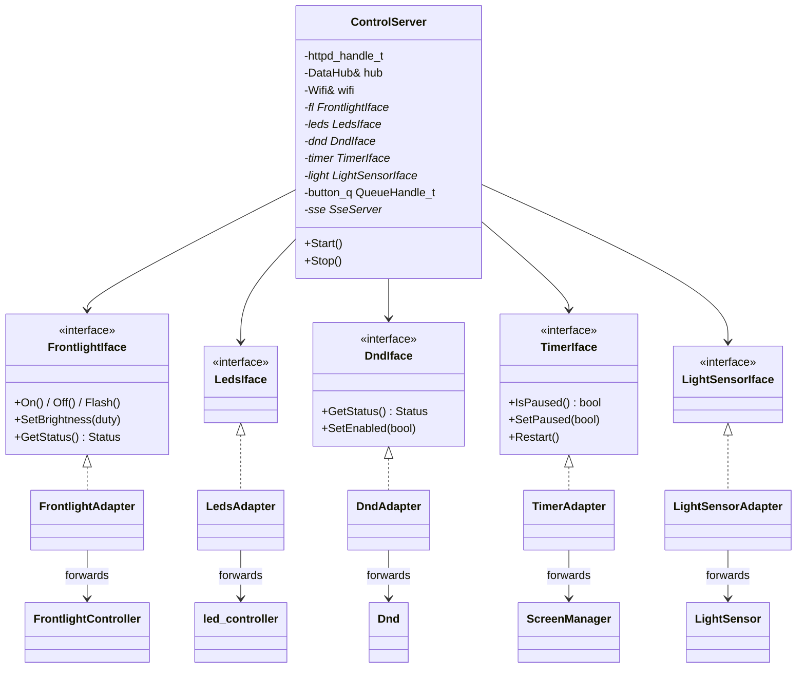

---

## 7. IO controllers (class diagram)

[main/io/](../main/io/) wraps the chip drivers in higher-level controllers
the rest of the app talks to.

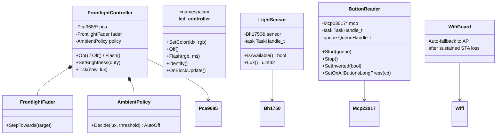

---

## 8. Boot sequence

`app_main` ([main/main.cpp:37](../main/main.cpp#L37)) is straight-line
wire-up. Each step populates `AppCtx`; the last call hands off to the
event loop.

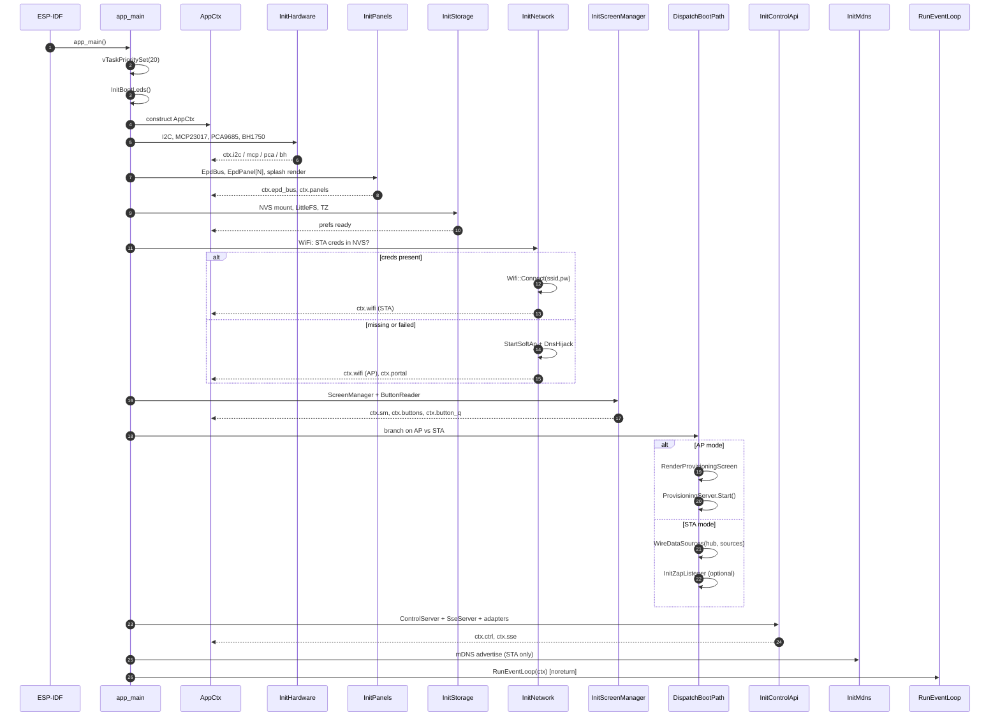

---

## 9. Data update → render

Hot path from a data source receiving a frame to pixels on the EPD.

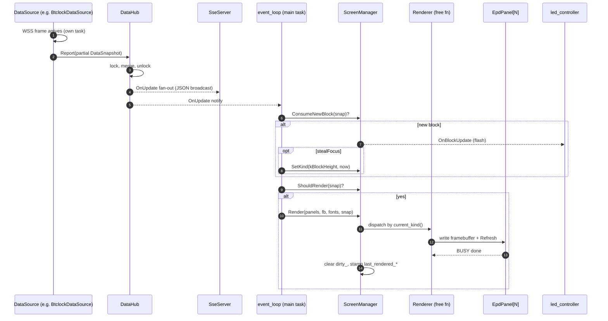

---

## 10. Button press → screen change

Buttons live on an MCP23017; the reader polls in its own task and drops
events into a queue the main task drains.

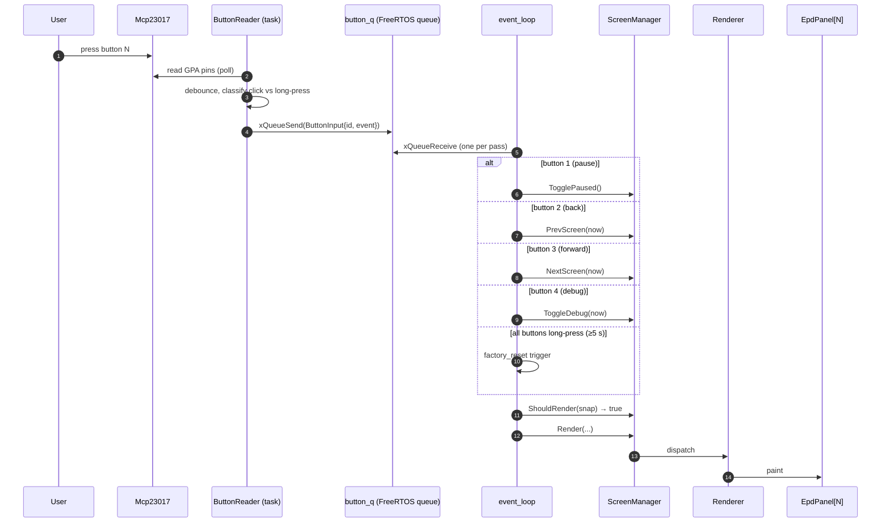

---

## 11. HTTP API → screen change

A WebUI / curl client jumps to a specific slot via
`POST /api/show/screen?s=<idx>`. Handlers run on the httpd worker task;
state mutation is queued for the main task to keep `ScreenManager`
single-threaded.

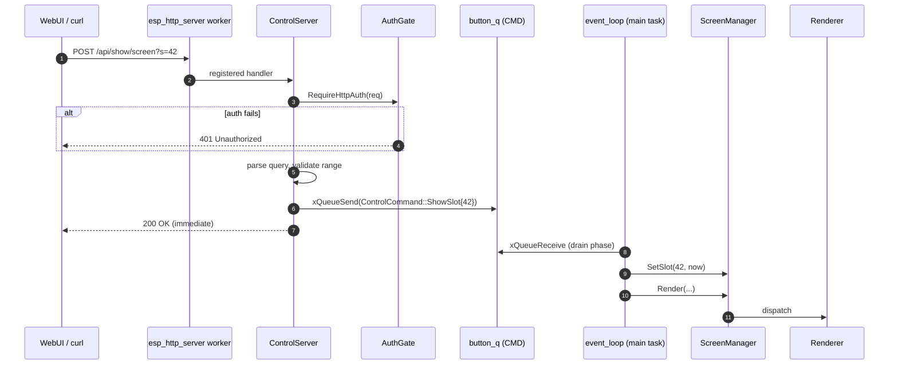

---

## 12. WiFi provisioning (AP → STA)

Cold-boot path when no STA credentials are stored: device puts up a
SoftAP, the user joins it, the captive portal collects the new SSID/PSK,
the device retries against STA, and on success persists creds and
restarts.

```mermaid
sequenceDiagram
    autonumber
    participant U as User phone
    participant W as Wifi
    participant DNS as DnsHijack
    participant PROV as ProvisioningServer
    participant P as Prefs (NVS)
    participant ESP as esp_restart

    Note over W: InitNetwork: no STA creds in NVS
    W->>W: StartSoftAp("BTClock-XXXX")
    W->>DNS: hijack *.local → 192.168.4.1
    PROV->>PROV: HTTP server up on AP
    U->>W: join AP SSID
    U->>PROV: GET / (captive portal)
    PROV-->>U: HTML form
    U->>PROV: GET /scan
    PROV->>W: Wifi::Scan()
    W-->>PROV: visible networks
    PROV-->>U: JSON list
    U->>PROV: POST /save {ssid, pw}
    PROV->>W: TryConnect(ssid, pw) [synchronous]
    alt creds work
        W-->>PROV: kConnected
        PROV->>P: SetString(ssid, pw) + Commit()
        PROV-->>U: 200 (rebooting)
        PROV->>ESP: esp_restart()
    else creds rejected
        W-->>PROV: kDisconnected (reason)
        PROV-->>U: 401/422 with reason for retry
    end
```

---

## 13. OTA firmware upload

`POST /upload/firmware` streams the new app partition. The handler
latches the OTA overlay on `ScreenManager` so the EPD shows progress
and the main loop stays out of the renderer for the duration.

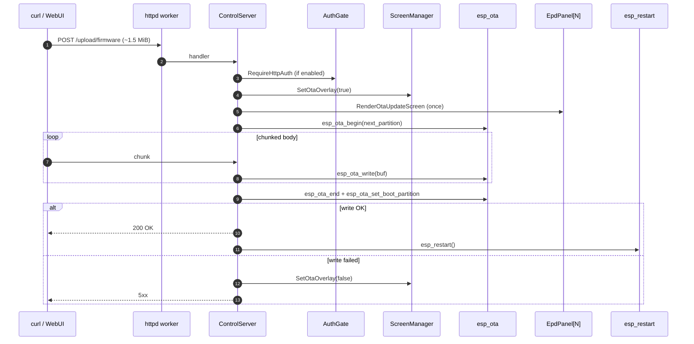

---

## 14. WiFi state machine

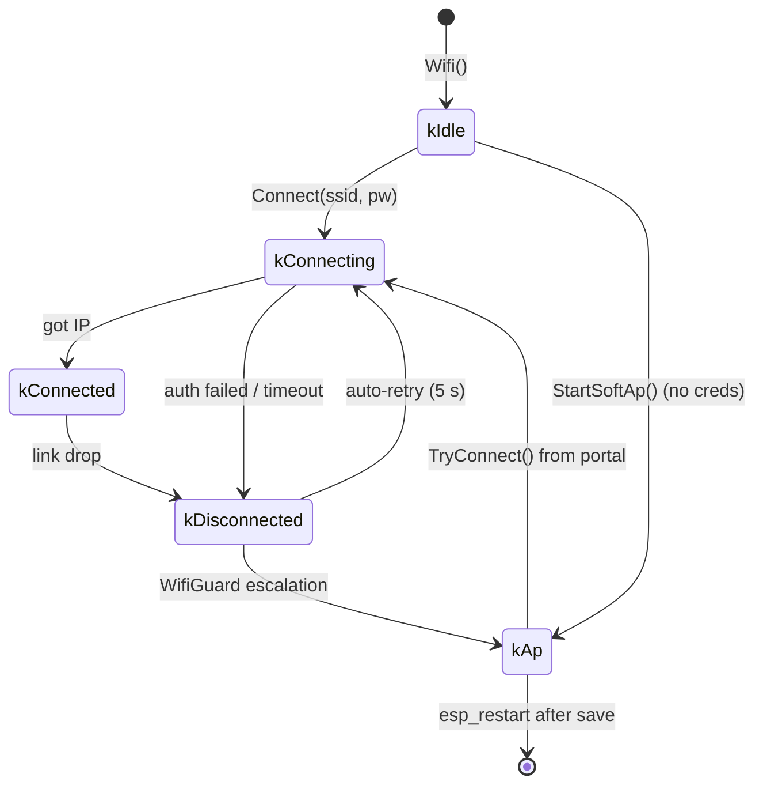

---

## 15. ScreenManager mode/overlay priority

ScreenManager has several latching overlays. Priority (highest first):
`OTA > Debug > Zap notify > Custom > rotation slot`.

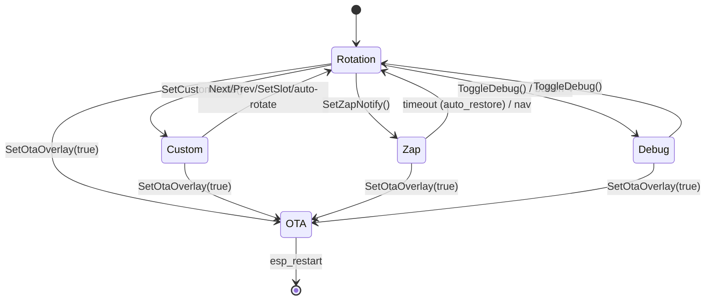

---

## File index

- Boot: [main/main.cpp](../main/main.cpp), [main/app/boot/](../main/app/boot/)
- Runtime: [main/app/event_loop.cpp](../main/app/event_loop.cpp), [main/app/screen_manager.hpp](../main/app/screen_manager.hpp)
- Data: [components/data_core/](../components/data_core/), [main/sources/](../main/sources/)
- Pools: [components/mining_pool_common/](../components/mining_pool_common/), [components/mining_pool_*/](../components/)
- HTTP: [components/webserver/](../components/webserver/)
- IO: [main/io/](../main/io/)
- Network: [components/wifi/](../components/wifi/)
- Settings: [components/settings/](../components/settings/), [components/prefs/](../components/prefs/)
