# BTClock — Handbook

The complete user reference. Read [`QUICKSTART.md`](QUICKSTART.md) first
if your BTClock isn't yet on the network.

This handbook focuses on the two production variants:

- **Rev A** — 4 MB flash, 2 MB PSRAM, 7 e-paper panels, no frontlight, no
  ambient sensor.
- **Rev B** — 8 MB flash, 2 MB PSRAM, 7 e-paper panels, PCA9685
  frontlight, BH1750 ambient sensor.

The 8-panel **V8** board and the 2.9" Rev A panel build are prototype /
unsupported and are mentioned only where they materially change a
behaviour.

> All screen images in this handbook are rendered off-device by the
> WASM screen pipeline (`tools/wasm/render_doc_screens.mjs`) and
> composited inside the BTClock acrylic outline. Real-device photos
> (which capture the e-paper micro-texture and frontlight halo) are
> tracked in [`docs/img/PHOTOS_NEEDED.md`](img/PHOTOS_NEEDED.md).

---

## Table of contents

- [1. Glossary](#1-glossary)
- [2. Hardware tour](#2-hardware-tour)
- [3. On-device controls](#3-on-device-controls)
- [4. WebUI tour](#4-webui-tour)
- [5. Screen catalogue](#5-screen-catalogue)
- [6. Fonts](#6-fonts)
- [7. Mining-pool guide](#7-mining-pool-guide)
- [8. Bitaxe integration](#8-bitaxe-integration)
- [9. Nostr zap setup](#9-nostr-zap-setup)
- [10. LEDs & frontlight](#10-leds-frontlight)
- [11. Do Not Disturb](#11-do-not-disturb)
- [12. HTTP API quick reference](#12-http-api-quick-reference)
- [13. Home Assistant integration](#13-home-assistant-integration)
- [14. Web flasher](#14-web-flasher)
- [15. Firmware updates](#15-firmware-updates)
- [16. Troubleshooting](#16-troubleshooting)

---

## 1. Glossary

- **Panel** — one e-paper module. The BTClock has 7 of them on Rev A
  / Rev B (8 on V8), each rendered independently. The first panel is
  usually a label ("BLOCK / HEIGHT", "BTC / USD", a pickaxe icon, etc.).
- **Screen** — a logical layout that paints all panels together. See
  the [Screen catalogue](#5-screen-catalogue).
- **Rotation** — the timer-driven cycle through your enabled screens.
- **Frontlight** (Rev B only) — soft white LEDs aimed at the panel
  faces. E-paper has no backlight; this is what makes the BTClock
  readable in the dark.
- **NeoPixel strip** / **LEDs** — RGB pixels along the back/top of the
  enclosure. They flash on new blocks, on Nostr zaps, and during boot.
- **DND** — Do Not Disturb: a flag (manual or scheduled) that mutes the
  LEDs and frontlight without touching the e-paper content.
- **Data source** — where the BTClock pulls block / price data from.
  Defaults to the BTClock relay (`btclock.dev`); can be swapped to
  mempool.space + Kraken, a custom WebSocket, or a Nostr feed.

## 2. Hardware tour

| Feature | Rev A | Rev B |
|---|---|---|
| MCU | ESP32-S3 (Lolin S3 Mini, N4R2) | ESP32-S3 (custom, N8R2) |
| Flash | 4 MB | 8 MB |
| PSRAM | 2 MB | 2 MB |
| EPDs | 7 × 2.13" GDEY0213B74 | 7 × 2.13" GDEY0213B74 |
| Buttons | 4 × tactile | 4 × tactile |
| NeoPixel strip | yes | yes |
| Frontlight (PCA9685, soft white) | no | yes |
| BH1750 ambient sensor | no | yes |
| Default panel build | `BTCLOCK_PANEL=2_13` | `BTCLOCK_PANEL=2_13` |

Front of the device:

- One acrylic faceplate, four corner screws, seven panel cutouts.
- A subtle "BTClock" wordmark below the panels.

Back / sides:

- USB-C for power + serial.
- Four push-buttons (described below).
- Reset and BOOT pin headers (only matter when recovering a bricked
  flash; see [Firmware updates](#15-firmware-updates)).

## 3. On-device controls

Four physical buttons, numbered left-to-right when looking at the
back. By default each press fires on release (a falling edge):

| Button | Action |
|---|---|
| **Button 1** | Pause / resume the rotation timer. The current screen stays up. |
| **Button 2** | Next screen (same as the auto-rotate step; the timer restarts). |
| **Button 3** | Previous screen. |
| **Button 4** | Toggle the debug overlay. A second press exits back to whatever data screen was up. |

Long-presses are detected by the firmware but currently unused —
nothing happens when you hold a button down.

Settings → Light & LEDs → **Inverse buttons** swaps button-1 with
button-4 (and 2 with 3). Useful if you mount the BTClock upside-down
or on the opposite side of a desk.

The **debug overlay** is for diagnostics: it shows free heap, current
IP, current screen id, build SHA, current data-source state, and a
partial-refresh tick counter. It's a full-refresh repaint with no
e-paper ghosting.

## 4. WebUI tour

The WebUI is a single-page Svelte app served from the LittleFS
partition. Three columns, each backed by a card on a wide screen and
stacked vertically on mobile. The screenshot below shows the layout —
yours will match once you open `http://btclock-xxxxxx.local/`.

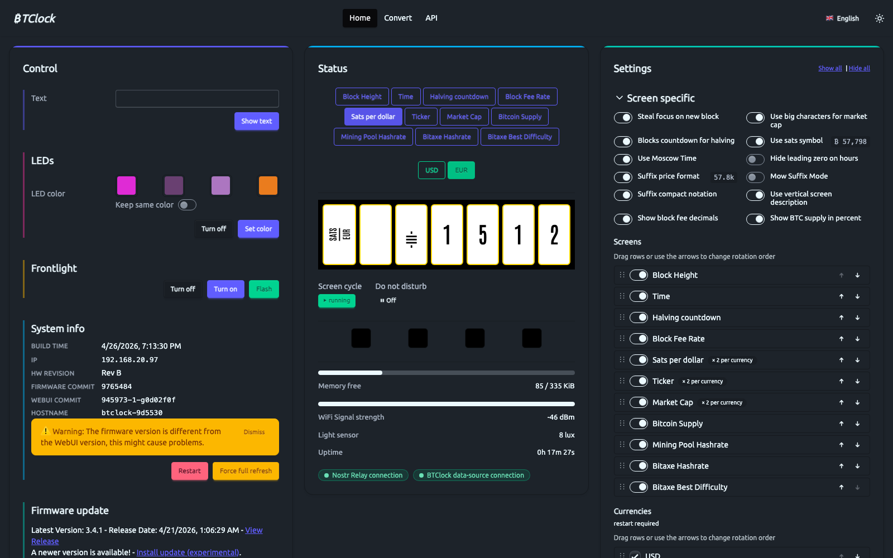

The same view in light theme:

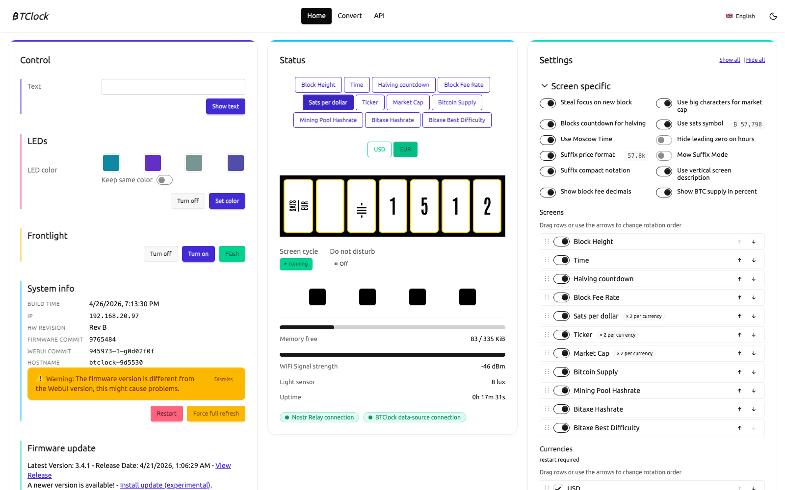

The theme toggle and the language picker live at the right edge of
the navbar. The picker covers English, Nederlands, Español and
Deutsch:

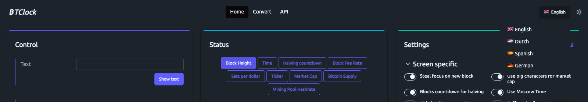

### 4.1 Control card (left)

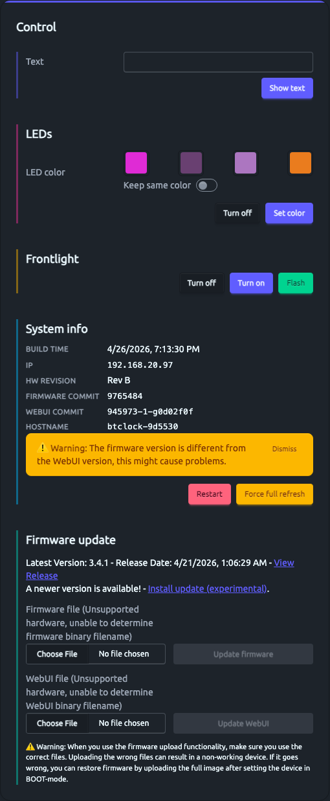


- **Text** — push up to 7 (or 8 on V8) characters, one per panel.
  `POST /api/show/text` under the hood. The text input is **uppercased
  on every keystroke** in the WebUI before being sent — the EPD glyph
  set is uppercase-only, so a lowercase character would otherwise paint
  as a blank tile. Truncation to `numScreens` happens via the input's
  `maxlength`. Press "Show text" and the panels paint immediately; any
  subsequent rotation tick or button press restores the rotation.
- **LEDs** — pick a colour for each pixel (or "keep same colour" for a
  uniform strip). "Set color" pushes via `POST /api/lights/set`. "Turn
  off" mutes the strip. The whole row is hidden when `disableLeds` is
  set in settings.
- **Frontlight** — Turn on / off / flash. The Flash button drives a
  single block-flash pulse (the same pattern that fires on a new
  block). The card is **capability-gated** on the
  `hasFrontlight && !flDisable` settings pair — Rev B exposes it
  today; Rev A and V8 hide it because their boards have no PWM
  channel wired.
- **System info** — Build time, IP, hardware revision, firmware commit,
  WebUI commit, hostname. If firmware-commit and webui-commit ever
  drift across a partial OTA, you'll see a yellow warning here. The
  warning has a **Dismiss** button — dismissal is keyed on the
  (gitRev, fsRev) pair and stored in `sessionStorage`, so a fresh
  build of either side re-prompts and closing the tab clears the
  silence. Closing the tab also clears any "I don't care" state, so a
  later genuine compatibility issue can't be hidden by yesterday's
  click.
- **Restart / Force full refresh** — soft-reboot, or force a full-EPD
  redraw (clears any ghosting from prior frames). Force-full-refresh
  is also fired automatically every `fullRefreshMin` minutes.
- **Firmware update** — "Check for update" hits `POST
  /api/firmware/auto_update`, which follows the `gitReleaseUrl` pref
  (default: the v4 Forgejo release feed) to find the
  `btclock_<variant>_ota.bin` asset matching this board × panel,
  verifies the sibling `.sha256`, and reboots into the new partition.
  Manual upload is via `POST /upload/firmware` — see
  [Firmware updates](#15-firmware-updates).

### 4.2 Status card (centre)

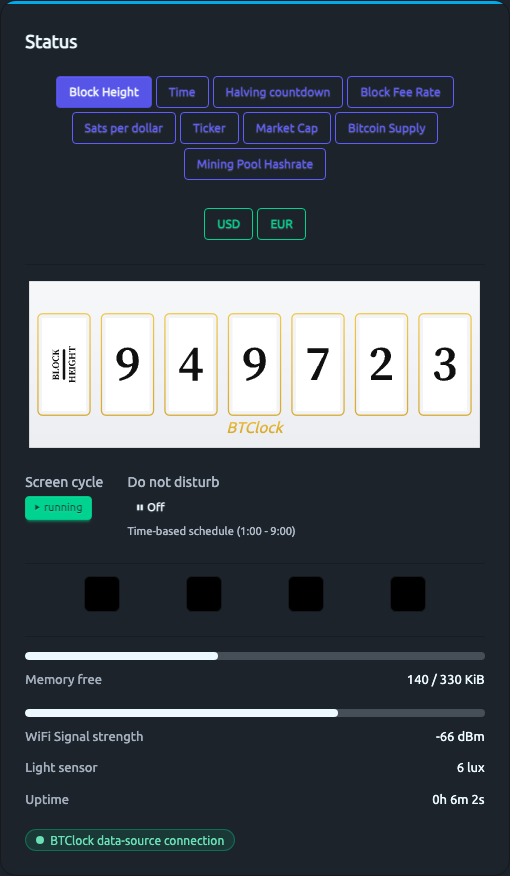

- **Screen tiles** — a live preview of what each panel is showing.
  The WebUI fetches a single `GET /api/status` snapshot on cold-start
  and from then on relies entirely on the SSE stream at `/events` for
  updates — it **does not poll** `/api/status`. If the SSE socket
  drops the WebUI reconnects with exponential backoff (1 s → 30 s
  cap), and a `data: closing` server frame triggers a flat 5 s clean
  reconnect.
- **Screen quick-jump** — buttons to jump straight to any rotation
  screen (`Block Height`, `Time`, …). Clicks fire optimistically: the
  highlight flips immediately, then reconciles on the next SSE frame;
  on a slow link this hides 200–800 ms of round-trip delay.
- **Currency selector** — when a price-bearing screen is active, click
  USD / EUR / etc. to flip currencies without waiting for the next
  rotation tick.
- **Screen cycle** (running / paused) and **Do not disturb** — clicks
  apply optimistically as well; if the API call rejects the toggle
  snaps back to server truth and a toast surfaces the error.
- **Connection-lost overlay** — when SSE drops, an overlay paints
  over the panel preview. The text reads **"Updating firmware…"** if
  an OTA upload is in progress (the WebUI sets this flag on upload
  start and clears it on the first frame after reconnect), otherwise
  the generic **"Trying to reconnect…"**. So users don't read a
  deliberate OTA reboot as a crash.
- **Sensors** — memory free, WiFi signal strength (linear -100 dBm
  → 0 %, -50 dBm → 100 %, clamped outside), ambient lux (Rev B
  only), uptime, **queue drops** (per-task event-send failure
  counters: `buttons` / `led` / `frontlight`; monotonic since boot;
  growing values point to a wedged consumer task — `frontlight`
  always reads 0 on Rev A, which has no frontlight hardware).
- **BTClock data-source connection** — green when the configured data
  source has produced a fresh tick recently.
- **LED indicators** — read-only colour swatches that mirror the live
  LED state. They are deliberately rendered as plain styled `<div>`s
  with `role="img"` (not `<input type="color" disabled>`); native
  colour inputs still pop the OS picker on click even when disabled.

### 4.3 Settings card (right)

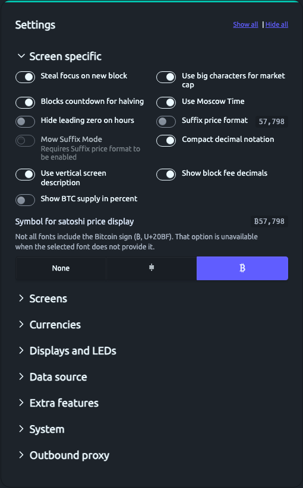

The Settings card is the long form of `/api/settings`. The full
reference (every key, default, NVS storage, validation rule) is in
[`SETTINGS.md`](SETTINGS.md). What follows is what each WebUI section
*does* in user-facing terms.

A few cross-cutting behaviours worth knowing before you go field by
field:

- **Per-field dirty tracking.** The Save button lights up only when at
  least one field differs from the last successful load or save. An
  "Unsaved changes" badge appears next to the section title.
- **Cmd / Ctrl + S** submits the form when it's dirty. The shortcut
  also unconditionally suppresses the browser's "Save Page As…"
  prompt while the settings card is mounted, even on a clean form.
- **Validation summary.** When at least one field fails inline
  validation (today: nostr pubkeys), an aggregate alert renders at
  the top of the form with anchor links — clicking one pops the
  relevant section open, scrolls the input into view, and focuses it.
- **Field-level save errors.** If the firmware rejects a PATCH with
  `{"error":"<field>:<reason>"}`, the WebUI splits that into a
  human-readable toast *and* opens + scrolls to the offending input.
  Validation vocabulary (`bad_type`, `unknown`, `bad_scheme`, `range`,
  `dup_id`, …) is documented in [`SETTINGS.md`](SETTINGS.md).
- **Drift detection.** When the tab regains focus, the WebUI re-fetches
  `/api/settings` and compares it to the pristine baseline. If a
  field the user hasn't locally edited has drifted on the device
  (another tab saved, factory reset, firmware reboot), a dismissible
  "settings changed on the device" banner offers a one-click reload.
- **Boot-only fields.** Fields whose `boot_only` flag is set in the
  firmware's `kFields` table are tagged "(restart required)" in the
  WebUI label. The list comes from a generated metadata module
  (`src/lib/types/settings.generated.ts` in the WebUI repo, produced
  by `scripts/generate-settings-meta.py` from `schema.hpp`); a unit
  test cross-checks UI labels against the metadata so the two can't
  silently drift.

#### Screen specific

- **Steal focus on new block** — when a fresh block height arrives,
  jump straight to the Block Height screen so you see the new value
  immediately. Default off (you may not want it stealing focus from
  the screen you were watching).
- **Use big characters for market cap** — large-glyph "$1.56T" form on
  the Market Cap screen. Off = small-character 3-digit-group form.
- **Blocks countdown for halving** — count halving in blocks (default)
  vs. days/hours.
- **Use sats symbol** — render price suffixes ("k", "M") with the
  custom sats-glyph font instead of plain text.
- **Use Moscow Time** — show "sats per dollar" rather than dollars per
  BTC for the inverse-price screen.
- **Hide leading zero on hours** — clock screen drops the leading zero
  on single-digit hours (`07:00` → `7:00`). Minutes always keep the
  leading zero. v4-only — the WebUI hides the toggle on v3 firmware.
- **Suffix price format** — use k/M suffixes on the BTC ticker (so
  $67.9k instead of $67890).
- **Mow Suffix Mode** — "Mow mode" price formatting variant. Named
  after Samson Mow, who popularised quoting Bitcoin in millions; the
  toggle renders the BTC/fiat price as `$X.XM` (millions of fiat per
  BTC) instead of the raw integer.
- **Suffix compact notation** — when a price suffix takes its own
  panel, fold the dot into the preceding digit cell to free a panel
  for one more digit.
- **Use vertical screen description** — rotate label panels 90° so
  "BLOCK / HEIGHT" reads top-to-bottom along the panel's long axis
  (default on; the layout the synthetic renders show).
- **Show BTC supply in percent** — toggle the Bitcoin Supply screen
  between "19.9 M" absolute form and "93.48 %" of the 21 M target.
- **Show block fee decimals** — show fractional sats/vB when the data
  source publishes a precise value, instead of rounding to the nearest
  integer.

The "use sats symbol" and "suffix price format" rows render a small
preview chip alongside the toggle (`57,798` / `₿ 57,798` / `57.7k` /
`57k`, depending on the flag combination), so the user can see what
each option emits without having to save and watch the device repaint.

#### Screens

Drag-reorder the rotation list, or use the arrows. Toggle each screen
on/off with the row's switch. Disabled screens skip in the rotation but
remain reachable via Button-2 / Button-3 / `POST /api/show/screen`.

#### Currencies

The set of currencies the price feed will pull. Drag-reorder is the
ticker / sats-per-dollar rotation order. Codes outside the
`availableCurrencies` list (USD, EUR, GBP, JPY, AUD, CAD …) are
ignored. Restart required after changes.

#### Network

- **Hostname prefix** — what `<prefix>-<mac>` resolves to via mDNS and
  DHCP. Default `btclock`.
- **mDNS** — advertise on `_http._tcp` and `_btclock._tcp`. Switch off
  if your network blocks multicast.
- **WiFi reboot timeout** — reboot the device after this many
  consecutive minutes of disconnected STA, in case WiFi got wedged.
  Default 10 minutes; 0 disables.
- **TX power** — clamp the WiFi radio. Useful for wall-warts where the
  radio brown-outs at full power. Default leaves the chip's setting
  alone.

#### Data sources

- **Source** — which feed the BTClock listens to:
  - `0` BTClock WS (default, `wss://ws.btclock.dev`),
  - `1` mempool.space + Kraken (independent block + price WSS clients),
  - `2` Nostr (data-only; every kind 30078 + zap receipt is BIP-340
    schnorr-verified before it touches the snapshot).
- **mempool.space instance** — host of the mempool.space deployment for
  source `1` (default `mempool.space`; flip secure if you self-host
  over plain `ws://`).
- **Custom endpoint** — when source `=1`, the BTClock-protocol custom
  WS host (`ws-staging.btclock.dev` is the staging relay). Disable SSL
  for plain `ws://`.
- **Min seconds between price updates** — throttle EPD price-write
  cadence. The price WS may push every second; e-paper does not need
  more than ~30 s. `0` disables the throttle.

#### Light & LEDs

- **Brightness** — NeoPixel master brightness (0..255).
- **Block flash colour** — the colour the strip pulses on a new block
  (default BTClock orange `#E04300`).
- **Disable LEDs** / **Flash on update** / **Flash on Nostr zap** —
  master mute, plus per-event flash toggles.
- **LED test on power** — run the rainbow boot test. Off = the strip
  goes straight to idle.
- **Frontlight** — capability-gated on the firmware's `hasFrontlight`
  flag (Rev B today; Rev A and V8 boards have no frontlight channel
  wired):
  - **Always on** — bypass the ambient-driven dimming.
  - **Disable** — master mute for the frontlight channel.
  - **Effect delay** — fade-step time in ms.
  - **Flash on update** / **Flash on zap**.
  - **Maximum brightness** — PWM duty at "100 %". Range 0..65535.
  - **Off when dark** — turn the frontlight off when ambient lux drops
    below the threshold below. Useful in a dark bedroom.
  - **Lux toggle threshold** — the lux level that flips between
    "room bright" and "room dim". Hysteresis is ±1 lux.
- **Inverse buttons** — see [On-device controls](#3-on-device-controls).

#### Do Not Disturb

- **Manual** — force the LED + frontlight strip off right now.
- **Scheduled** — start/end hour+minute window. Honors local time
  (the configured timezone).

#### Time zone

IANA name (e.g. `Europe/Amsterdam`). Drives clock-screen rendering and
the DND schedule. Live — `setenv("TZ", ...) + tzset()` is called on
PATCH.

#### Mining pool

See [Mining-pool guide](#7-mining-pool-guide) below — the field labels
shift per pool because each pool means something different by
"`miningPoolUser`".

#### Bitaxe

See [Bitaxe integration](#8-bitaxe-integration).

#### Nostr / zap

See [Nostr zap setup](#9-nostr-zap-setup).

#### HTTP auth / OTA

- **Require HTTP basic auth** — gate every `/api/*` endpoint behind
  user/password. Static assets stay open so the WebUI itself can load.
- **Username** / **Password** — the credentials. Empty password is
  rejected (locks itself out).
- **Enable OTA** — gate the firmware-upload path. Independent password
  for OTA pushes.
- **Auto-update URL** — the releases endpoint the (currently
  stubbed) auto-update path would pull from.

#### Diagnostics

- **Enable debug log** — boost ESP-IDF log levels to DEBUG. Reboot
  required.

## 5. Screen catalogue

Every screen below is rendered live by the firmware against the same
data the WebUI shows. The synthetic preview images are produced via
`tools/wasm/render_doc_screens.mjs`; the layouts are pixel-identical
to what the device paints, modulo the e-paper texture.

The first panel of every screen is the **label** — by default rotated
90° so it reads top-to-bottom along the panel's long edge. Disable
"Use vertical screen description" to read labels horizontally instead
(useful at higher zoom levels).

### Provisioning (first boot)

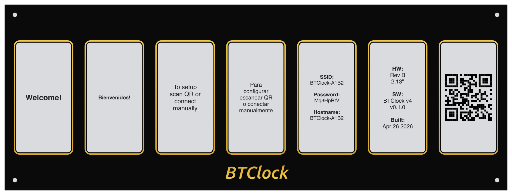

Painted on first boot, after a factory reset, or when no Wi-Fi
credentials are saved yet. Panel 0/1 carry the welcome (English /
Spanish), panels 2/3 the join instructions, panels 4/5 the live SSID +
password + hostname + hardware/firmware metadata, and panel 6 a
WiFi-join QR. The QR encodes
`WIFI:T:WPA;S:BTClock-XXXX;P:<password>;;` so most phones will offer to
join the AP automatically when scanned.

The synthetic preview above is rendered by `tools/wasm/render_doc_screens.mjs`
using SVG (the on-device renderer uses the firmware's Atkinson font +
qrcodegen). The QR pattern in the doc image is a placeholder — your
device's QR is generated live from its own SSID/password.

### Block height

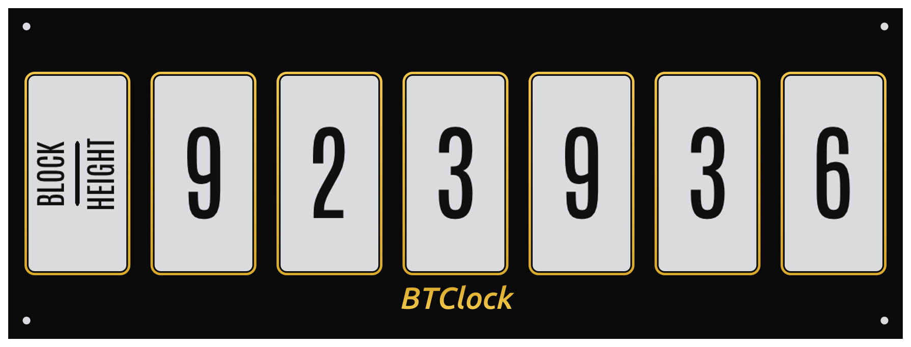

Latest block height. Updates on every new block; with **Steal focus
on new block** the device flips to this screen automatically.

#### Label orientation (`verticalDesc`)

The first panel of nearly every screen carries a two-line label
("BLOCK / HEIGHT", "MOW / UNITS", "BTC / USD", etc.). `verticalDesc`
controls whether that label reads along the panel's long axis
(vertical, default) or along the short axis (horizontal):

| `verticalDesc=true` (default) | `verticalDesc=false` |
|---|---|
|  | 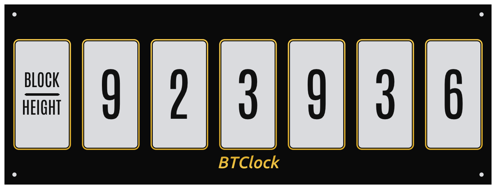 |

#### Inverted colour (`invertedColor` / "Text colour")

The WebUI **Text colour** select maps to `invertedColor`. Default is
black-on-white (the e-paper paints black ink onto its white substrate);
flipping it gives white-on-black, which can read as a more
"display-like" look in dim rooms but draws a touch more current
during a full refresh:

| Black on white (default) | White on black (`invertedColor=true`) |
|---|---|
|  | 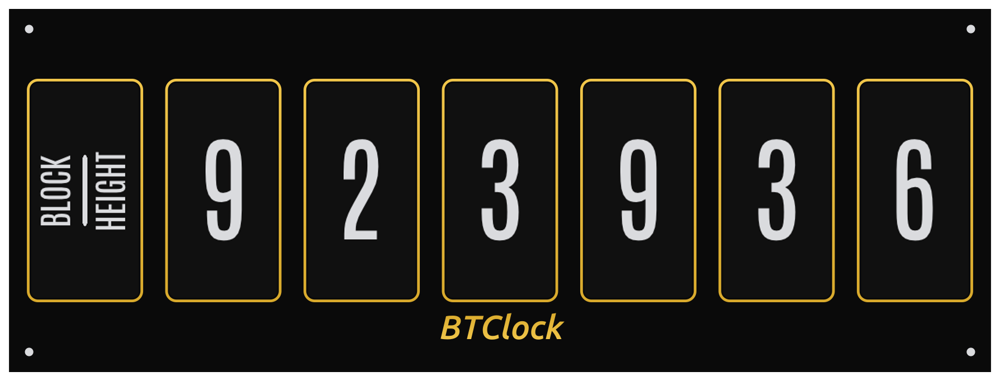 |

The inversion is applied at the framebuffer-byte level inside the EPD
driver (`SSD1680Base::WriteVram` XORs every byte before SPI DMA when
the global-invert flag is set), so every screen — not just block
height — picks up the swap automatically.

The vertical orientation matches the digit panels' rendering axis (the
EPDs are mounted in portrait), so the whole row reads as one
top-to-bottom unit. The horizontal orientation makes labels easier to
spot at a glance from across the room. Pick whichever reads better in
your environment — the toggle is live, no reboot needed.

Internally this flips the rotation of the label slot 90° CCW relative
to the digit slots; the digit cells are unaffected. The label panel
sees a 250×122 region (instead of 122×250), which is why the type
sets differently.

Affected by: `stealFocus`, `verticalDesc`.

### Time

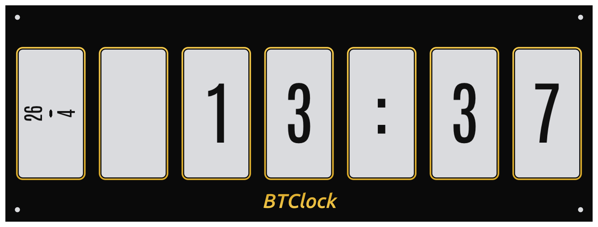

The wall-clock time, rendered with the configured font on the digit
panels. The label panel shows the date as `dd/mm` (split-text);
panels 1..N-1 paint `HH:MM` right-justified with `:` in the slot
between hours and minutes. Minutes always have leading zeros; hours
can drop the leading zero (`hideLeadZero`). Until SNTP returns the
first plausible epoch the digit panels stay blank rather than
flashing an obviously-wrong epoch.

#### Time zones (`tzString`)

The clock screen, halving countdown, and the Do-Not-Disturb scheduler
all read local time, so the device needs to know which IANA zone you
live in. The setting is **`tzString`**, default `"Europe/Amsterdam"`.

- The format is the standard IANA zone name (e.g. `"Europe/Amsterdam"`,
  `"America/New_York"`, `"Asia/Tokyo"`, `"Australia/Sydney"`,
  `"UTC"`). A full list lives in
  [data/src/lib/timezones.json](https://git.btclock.dev/btclock/btclock_v4/src/branch/main/data/src/lib/timezones.json) — the
  WebUI populates the dropdown from that file.
- DST transitions are applied automatically — the firmware bundles the
  IANA tz database, so e.g. `"Europe/Amsterdam"` flips between CET and
  CEST on its own.
- PATCHing a new zone is **live**: the change takes effect on the next
  clock-screen paint. No reboot. Internally `setenv("TZ", ...) +
  tzset()` runs inline.
- The zone affects display only — the device's RTC is synced via SNTP
  in UTC and converted at render time. Changing `tzString` won't
  shift any timestamps already stored in NVS.
- Set the wrong zone? Both the clock screen and the DND start/end
  hour-minute window slide by your zone offset. If DND fires at the
  wrong time, that's the first thing to check.

Affected by: `tzString`, `hideLeadZero`, `verticalDesc`, `fontName`.

### Halving countdown

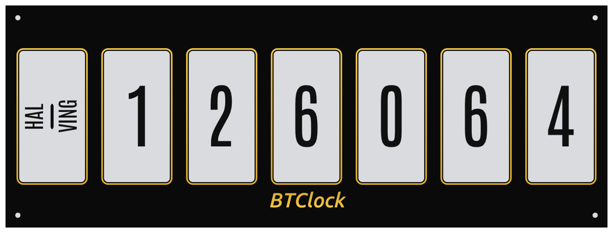

Blocks remaining until the next halving. The default form fills the
digit panels with a plain integer block count (~210k blocks per
halving epoch, so the count shrinks to zero over ~4 years).

#### Time-remaining form (`useBlkCountdown=false`)

Set `useBlkCountdown=false` to swap the layout from blocks-remaining
to a human-readable years / days / hours / minutes breakdown computed
against the average ~10-minute inter-block interval:

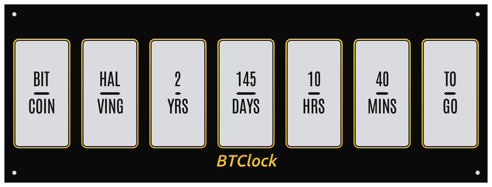

The label slot turns into "BIT / COIN" + "HAL / VING" across the first
two panels, and the digit cells get unit suffixes (`YRS`, `DAYS`,
`HRS`, `MINS`) plus a closing "TO / GO" panel. The blocks form is
more accurate (blocks land deterministically every halving epoch); the
time form reads more naturally for non-developers.

Affected by: `useBlkCountdown`, `verticalDesc`, `fontName`.

### Block fee rate

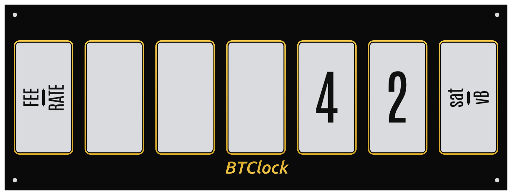

Fee rate of the latest mined block, in sats/vB. The final panel is a
"sat / vB" unit-glyph cell.

#### Decimal-form (`blockFeeDec=true`)

When `blockFeeDec=true` and the upstream data source publishes a
fractional fee, the layout engine paints a `X.Y` form using one of
the digit cells for the decimal point. Below: 4.7 sats/vB rendered
with the dot on its own panel:

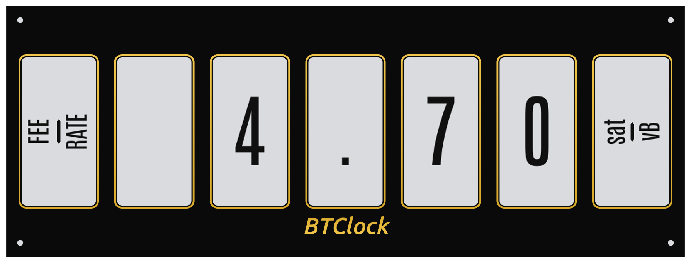

Decimal mode silently downshifts to integer when the fractional value
doesn't fit the available digit budget — there's no panel-overflow
penalty for leaving the toggle on.

Affected by: `blockFeeDec`, `verticalDesc`, `fontName`.

### Sats per dollar (Moscow Time)

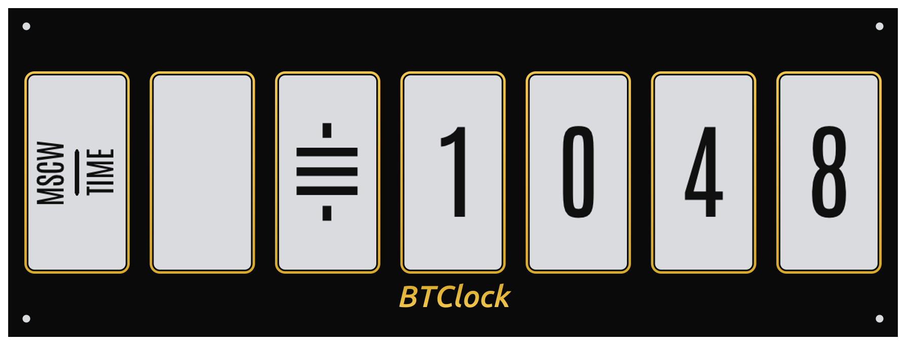

The inverse of the BTC price — how many sats one US dollar buys. Shown
when `useMscwTime=true`. The `=` glyph between the label and the digits
is the sats prefix (`useSatsSymbol`).

#### What "Moscow Time" actually means

"Moscow Time" is the Bitcoin-community shorthand for **how many sats
one fiat unit buys** (default: USD). The arithmetic is the inverse of
the dollar-per-BTC price:

> `sats per dollar = 100,000,000 / btc_price_usd`

Because 1 BTC = 100,000,000 satoshis, the readout moves *opposite* to
the price ticker: as BTC climbs in dollar terms, the sats/dollar number
falls (each dollar buys fewer sats), and vice versa. Most price
displays show only the BTC→fiat direction, so flipping to the
fiat→sats direction makes small percentage moves in BTC's price
visually obvious.

The "Moscow" name comes from a 2021 Twitter video call featuring Jack
Dorsey — viewers spotted what looked like a digital clock in the
background reading "1952", and a brief debate broke out over whether
that meant he was in Moscow (which uses a 24-hour digital clock
convention). It turned out to be a sats-per-dollar display, not a
clock, and the meme stuck. The name is tongue-in-cheek; the readout
itself is just the inverse exchange rate.

Worked example at $95,432 / BTC:

> `100,000,000 / 95,432 ≈ 1,047 sats per USD`

…which the screen renders as "1 047" across the digit panels (with the
`=` sats-symbol prefix when `useSatsSymbol=true`).

#### Sats glyph toggle (`useSatsSymbol`)

`useSatsSymbol=true` (default) prefixes the digit row with the
custom sats glyph (the `=`-flavoured cell from the BTClock font
stack) and uses the "MSCW / TIME" label slot. With `useSatsSymbol=false`
the glyph cell stays blank and the digits start one panel further
right:

| `useSatsSymbol=true` (default) | `useSatsSymbol=false` |
|---|---|
|  | 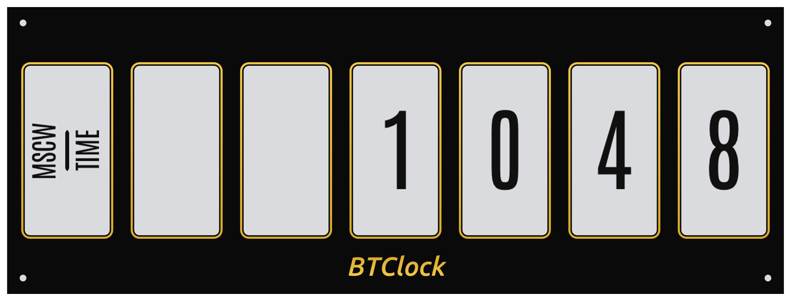 |

The toggle is purely cosmetic — the underlying sats-per-fiat number
is identical. Turn it off if you don't want the custom glyph or if
your audience reads the screen at a glance and the `=` symbol is
adding noise.

#### Sats-symbol variants (`satsVariant`)

The SatoshiSymbol font ships **16 glyph variants** at codepoints
`U+E000`..`U+E00F`. The `satsVariant` setting (uint, 0..15, default
7) picks which one renders on the moscow-time screen and the
nostr-zap overlay when `useSatsSymbol` is on:

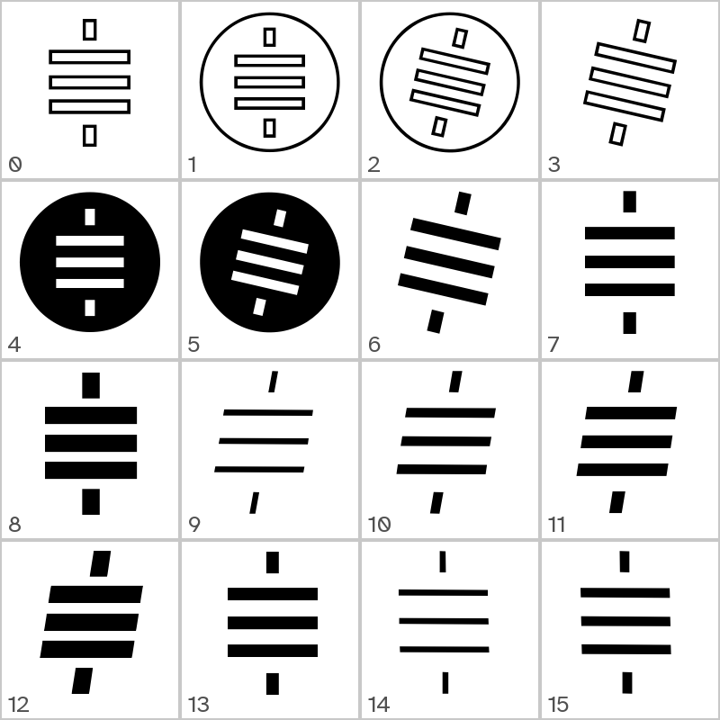

The WebUI exposes a visual picker on the Settings page — each of the
16 glyphs is rendered inline so you can click the one you want
without consulting the contact sheet. The selected index PATCHes
through `/api/settings` automatically. To set the value from the
command line:

```bash
curl -X PATCH -H 'Content-Type: application/json' \
  -d '{"satsVariant":5}' http://btclock-xxxxxx.local/api/settings
```

The runtime hook calls `ScreenManager::SetSatsVariant` + `MarkDirty()`
so the next render of moscow-time or nostr-zap paints the new glyph.
Out-of-range values are rejected at PATCH time (the schema declares
`min=0, max=15`).

Regenerate the contact sheet from the embedded TTF with
[`tools/fonts/render_sats_variants.py`](https://git.btclock.dev/btclock/btclock_v4/src/branch/main/tools/fonts/render_sats_variants.py).

Affected by: `useMscwTime`, `useSatsSymbol`, `satsVariant`, active currency, `fontName`.

### BTC ticker

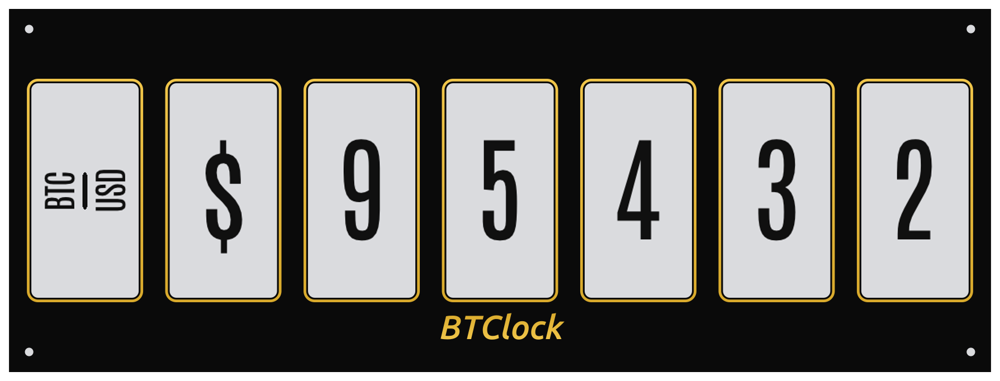

Whole-currency BTC price. Iterates through every code in `actCurrencies`
on each rotation tick.

#### Suffix mode (`suffixPrice`)

With `suffixPrice=true` the digits get a k/M suffix so prices fit in
fewer panels and round-tripping through 5/6-digit values doesn't
constantly reflow the layout:

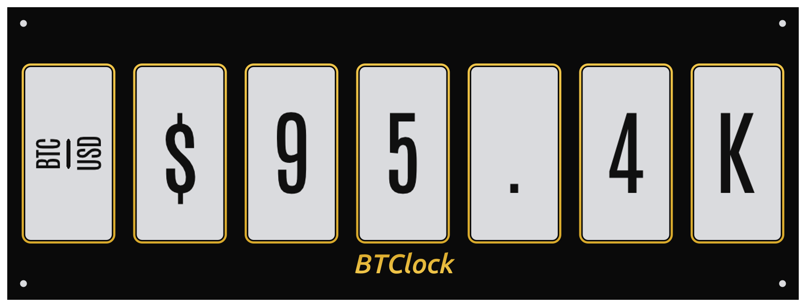

Above: `$95,432` rendered as `$95.43k` with the `BTC/USD` label on the
first panel, the `$` symbol on the second, the digits + decimal dot
filling the middle, and a `k`-suffix unit cell on the right.

`suffixPrice=false` is the default and preserves the full integer
form on the digit cells. Auto-suffix still fires past 7 digits to
prevent overflow, regardless of the flag.

#### Suffix compact notation (`suffixShareDot`)

The decimal dot normally takes its own panel cell. Toggling
`suffixShareDot` folds the dot into the preceding digit's cell so the
whole number gets one extra cell of width — useful at high prices
where a single-digit "$1.M" form is too coarse and "$1.23M" needs the
extra digit room.

| `suffixShareDot=false` (default) | `suffixShareDot=true` |
|---|---|
|  | 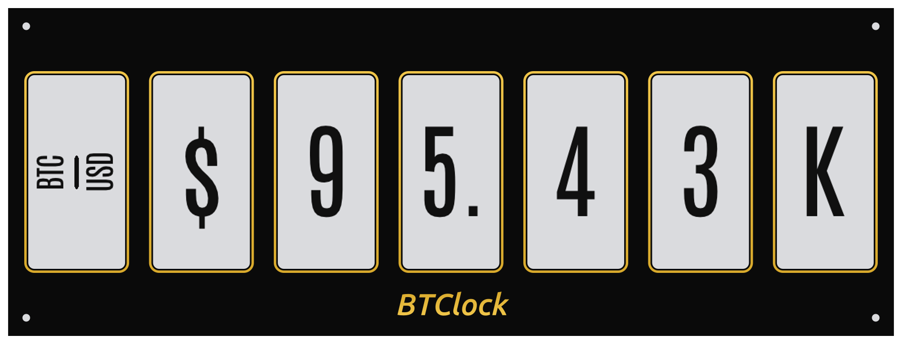 |

Both panels render the same `$95,432` price with `suffixPrice=true`.
On the left the dot sits on its own panel and the layout fits two
digits (`9`, `5`) plus the `k` suffix; on the right the dot folds
into the "5." cell and a third digit (`3`) lands on the freed panel.

#### Mow mode (`mowMode`)

Named after **Samson Mow**, the Jan3 CEO who routinely quotes the
Bitcoin price in millions of fiat ("$1M Bitcoin"). With `mowMode=true`
the BTC/fiat price renders in **millions of fiat per BTC** instead of
the raw integer — the label slot turns into "MOW / UNITS" and the
trailing cell carries an `M` suffix:

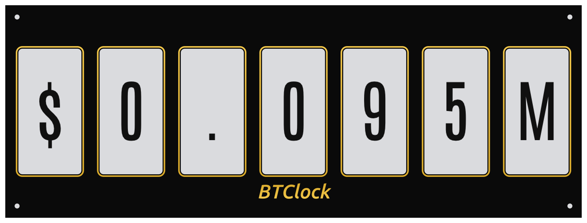

Above: `$95,432` BTC price → `$0.095M` (≈ 0.1 millions of dollars
per BTC). The `M` cell on the right is the megaunit suffix; the price
body is a normal suffix-form layout. The view re-orients the brain
around the long-term "Bitcoin is going to a million dollars" frame
without any of the underlying maths changing.

Affected by: `actCurrencies`, `suffixPrice`, `suffixShareDot`,
`mowMode`, `useSatsSymbol`, `fontName`.

### Market cap

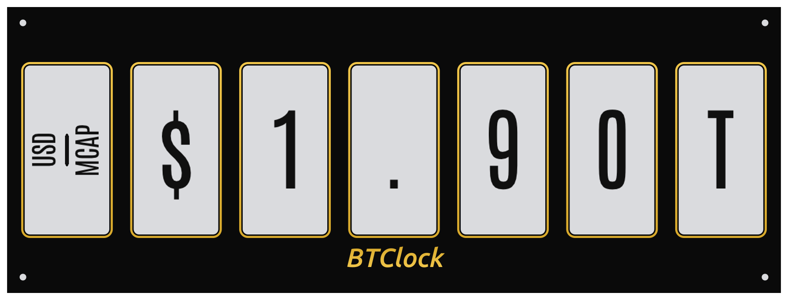

Bitcoin market cap = supply × price, rendered in the compact
"$1.56T" form. The label slot reads "MCAP / USD" (or whichever
currency).

The `mcapBigChar` setting and the small-character 3-digit-group form
are exposed via the JSON API for headless integrations, but the
on-device EPD renderer always paints the big-char form today — so
the WebUI toggle has no visible effect on a live device. Documented
here for completeness, not because it changes the rendered screen.

Affected by: active currency, `fontName`.

### Bitcoin supply

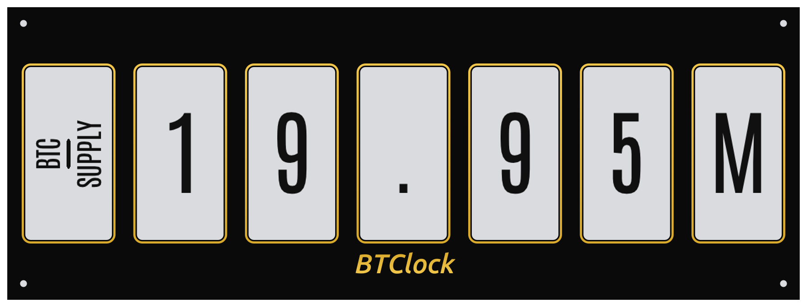

Mined BTC supply derived from the current block height. Default is
absolute ("19.9M"); set `supplyPercent=true` for the percentage-of-21M
form:

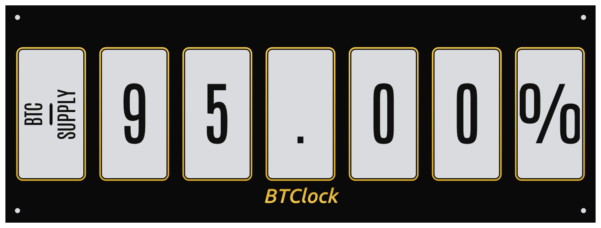

Affected by: `mcapBigChar`, `supplyPercent`, `fontName`.

### Mining pool hashrate

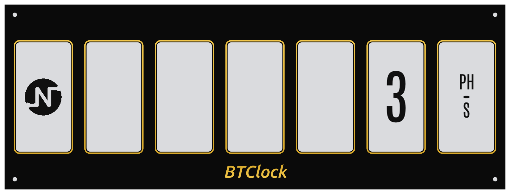

Hashrate of the configured mining pool. Panel 0 carries the pool's
logo (an MDI icon for built-in pools, or a fetched LittleFS-cached PNG
when the pool publishes one — see `poolLogosUrl`).

Affected by: `miningPoolStats`, `miningPoolName`, `poolGlobalStats`,
`poolPollSec`, `fontName`.

### Mining pool earnings

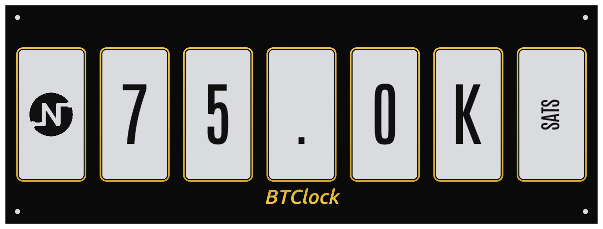

For pool/user combinations that publish per-user earnings: the day's
expected sats payout. Shown in lieu of the hashrate screen when the
"earnings" rotation slot is enabled.

Affected by: same as Mining pool hashrate, plus `miningPoolUser`.

### Bitaxe hashrate

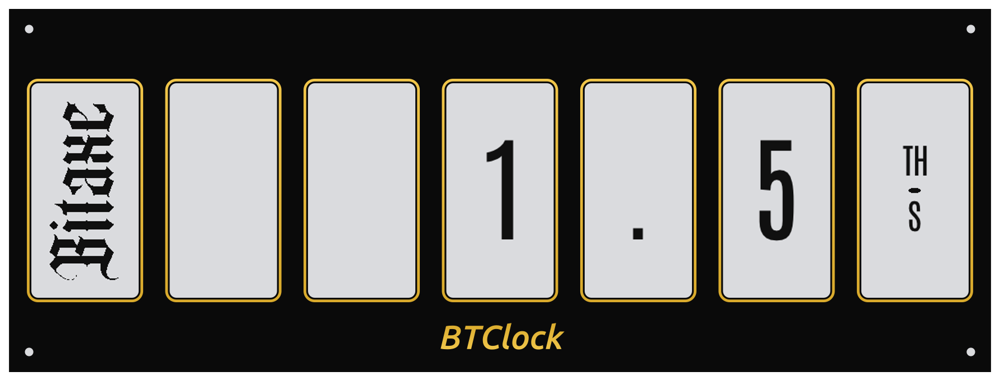

GH/s reported by the configured Bitaxe miner (HTTP poll of AxeOS).
Final panel carries the unit glyph (G, T, P) with tail-aware
auto-scaling.

Affected by: `bitaxeEnabled`, `bitaxeHostname`, `bitaxePollSec`,
`fontName`.

### Bitaxe best difficulty

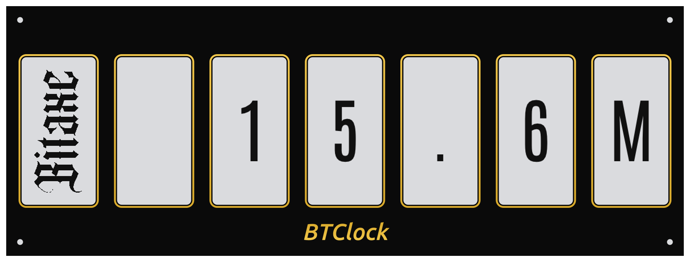

Best lifetime share difficulty from the Bitaxe — the "personal best"
proof-of-work the miner has produced. AxeOS publishes a pre-formatted
string ("15.6M", "1.2G"); the device renders it verbatim.

Affected by: `bitaxeEnabled`, `bitaxeHostname`, `fontName`.

### Nostr zap (push overlay)

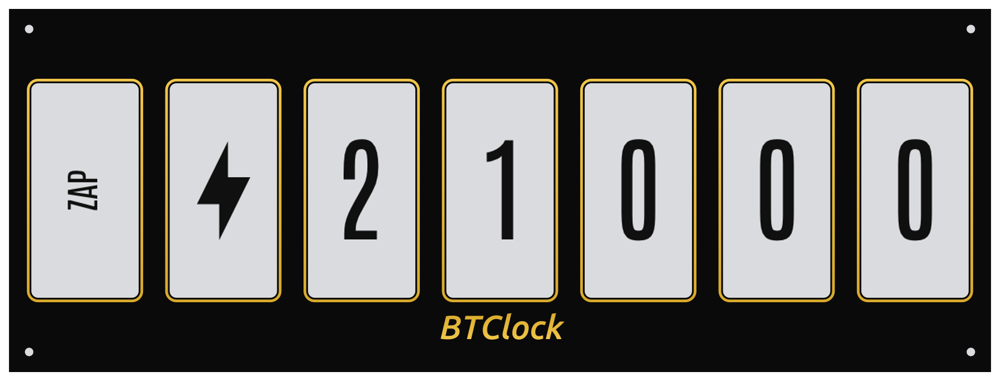

Pop-up triggered by an incoming NIP-57 zap receipt. The amount in
sats fills the digit panels, the LEDs and frontlight flash the
block-flash colour. After a short timeout (or any nav event) the
device returns to whatever screen was up before — set
`scrnRestoreZap=false` to leave the zap screen up instead.

Affected by: `nostrZapNotify`, `nostrZapPubkey`, `ledFlashOnZap`,
`flFlashOnZap`, `scrnRestoreZap`.

### Custom text (push)

`POST /api/show/text?t=HELLO` (or `POST /api/show/custom` with a
per-panel array) puts arbitrary text on the panels. Stays up until the
next nav event. Useful for build alerts, notifications, "BACK SOON",
etc.

### Debug overlay

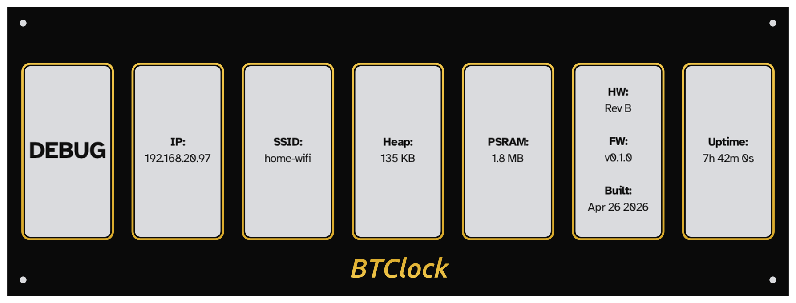

Toggled by Button-4 (a second press exits back to whatever data
screen was up). One value per panel:

| Panel | Field | Notes |
|---|---|---|
| 0 | `DEBUG` title | auto-fits to the panel width |
| 1 | `IP:` | dotted-quad of the STA lease, or `-` when offline |
| 2 | `SSID:` | the joined network's SSID |
| 3 | `Heap:` | free `MALLOC_CAP_INTERNAL` (KB / MB) |
| 4 | `PSRAM:` | free `MALLOC_CAP_SPIRAM` |
| 5 | `HW:` / `FW:` / `Built:` | board variant, firmware version (tag for releases / short SHA for snapshots / `-dirty` suffix on uncommitted builds — see [4.1 Control card](#41-control-card-left) for the same string in the WebUI), and compile date |
| 6 | `Uptime:` | seconds since boot, formatted `Xd Yh Zm` / `Hh Mm Ss` / `Mm Ss` |
| 7 (V8 only) | `Exit:` hint | "press button 4 again" |

The overlay paints with `RefreshKind::kFull` on entry (clears any
ghosting accumulated by partial repaints) and re-paints with
`RefreshKind::kPartial` once a second so heap/PSRAM/uptime stay
live without visible flicker.

### OTA update overlay

Painted while a `POST /upload/firmware` push is in flight. Shows
progress percentage and an upload counter; freezes the rotation timer
so a parallel data tick can't stomp the overlay mid-write.

## 6. Fonts

Pick the digit face under Settings → Display → **Font name**. The
label panel always uses Oswald-bold (it's a separate slot on the font
table); only the digit / suffix / unit glyphs swap.

| Font | `fontName` id | Preview |
|---|---|---|
| **Antonio** (default) | `antonio` | 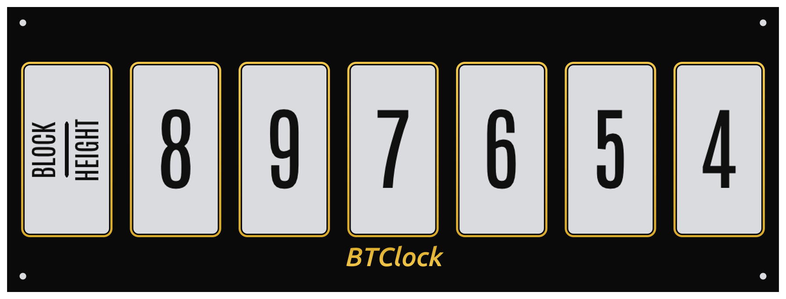 |
| **Antonio SemiBold** | `antonioSemiBold` | 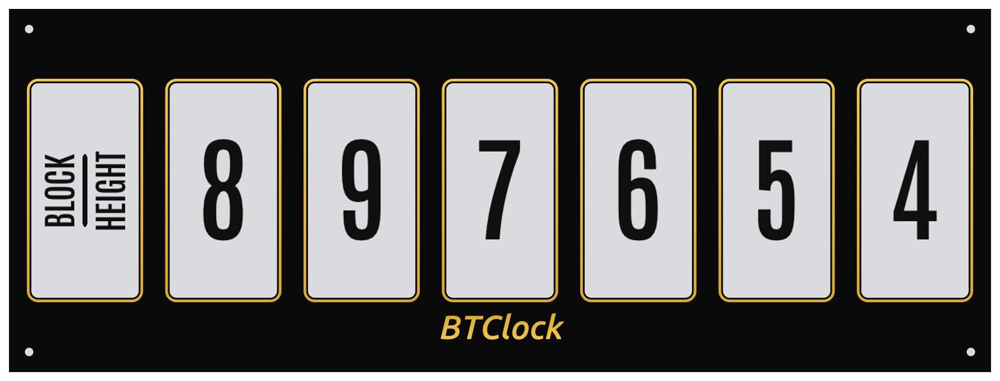 |
| **Antonio Bold** | `antonioBold` | 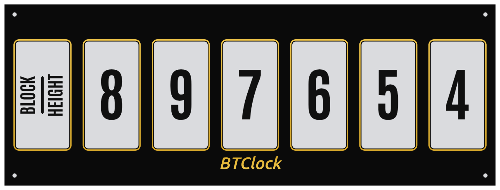 |
| **Oswald** | `oswald` | 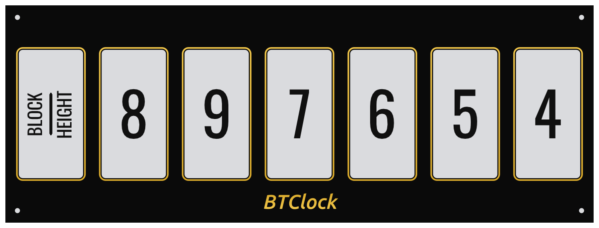 |
| **Inter** | `inter` | 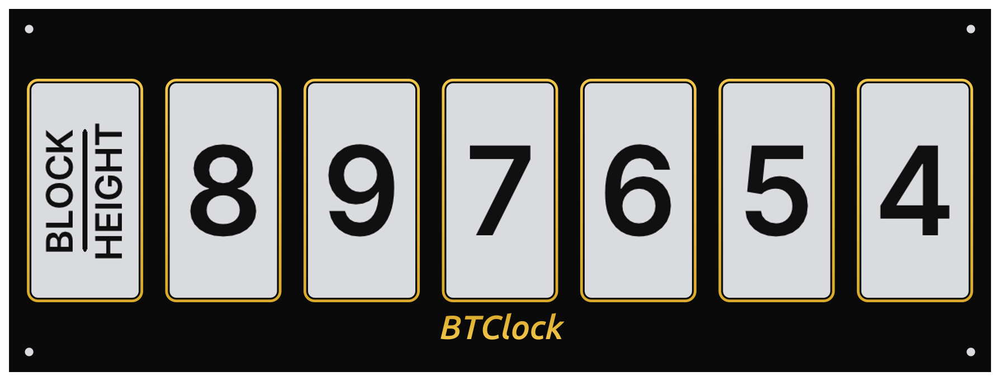 |
| **Source Serif** | `sourceSerif` | 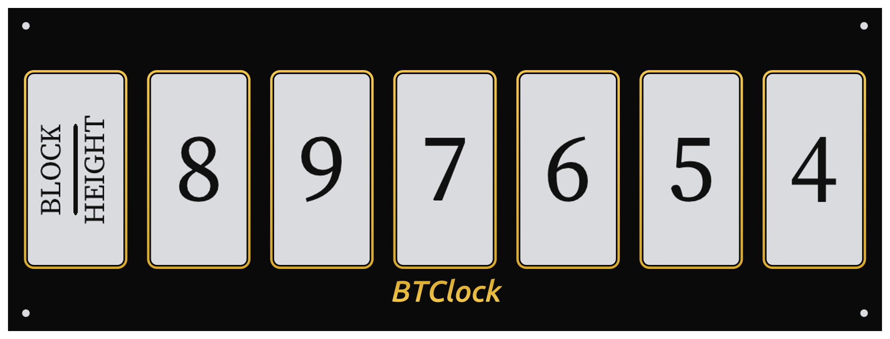 |
| **Merriweather** | `merriweather` | 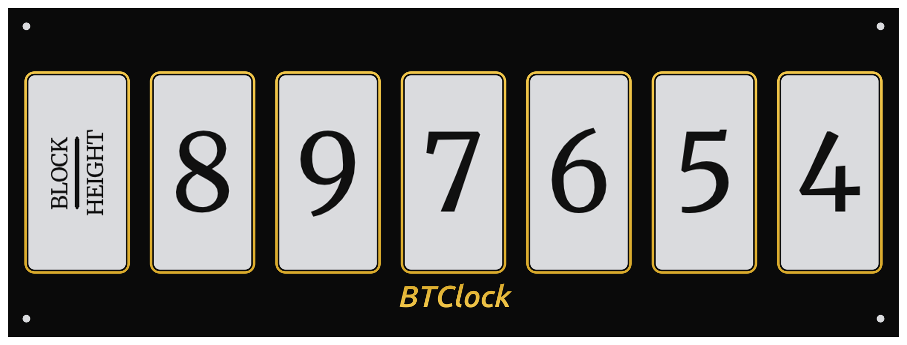 |
| **Bitter** | `bitter` | 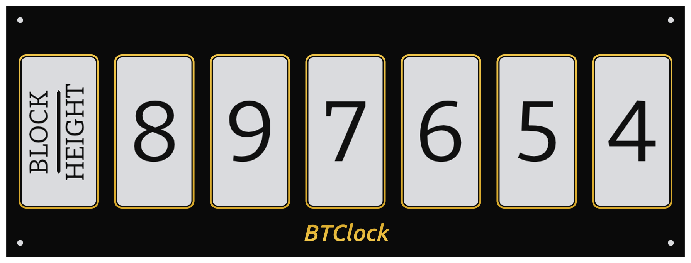 |
| **Atkinson Hyperlegible** | `atkinson` | 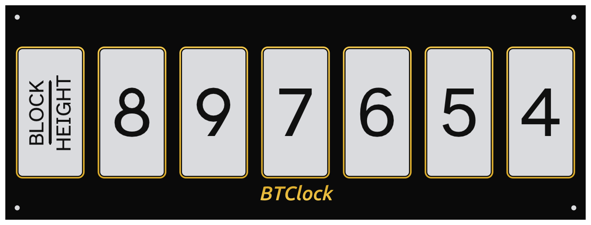 |

Antonio is a condensed display sans, designed for tight digit columns
on the BTClock's narrow 2.13" panels. The three Antonio cuts share the
same letterforms but step up in stroke weight: Regular (wght=400) →
SemiBold (600) → Bold (700). Pick **Antonio SemiBold** when the default
reads too thin in bright light or at glance distance, and
**Antonio Bold** for maximum stroke contrast — useful when the device
is mounted further from the viewer or when the e-paper panels are
viewed under a frontlight.

To preview your own data live (your block height, your currency,
your mining-pool name) without flashing — open
`tools/wasm/preview.html` from a checkout (see
[`BUILD_FROM_SOURCE.md`](BUILD_FROM_SOURCE.md) for how to build the
WASM bundle, then `python3 -m http.server 8000 --directory tools/wasm`).

## 7. Mining-pool guide

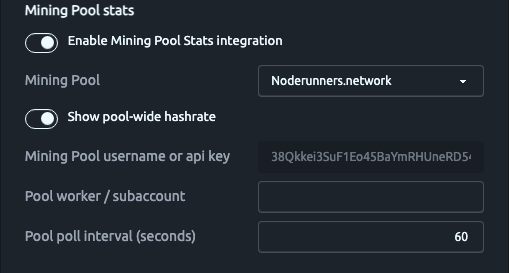

The BTClock supports 13 pools:

| `miningPoolName` | Display | Notes |
|---|---|---|
| `ocean` | Ocean | Public payout-address based stats. |
| `noderunners` | Noderunners | Default; works credentialless with `poolGlobalStats=true`. |
| `satoshi_radio` | Satoshi Radio | Same shape as Noderunners. |
| `braiins` | Braiins | Username-based. |
| `public_pool` | Public-Pool | Worker / address based. |
| `local_public_pool` | Local Public-Pool | Self-hosted instance — set `localPoolHost`. |
| `gobrrr_pool` | GoBRRR Pool | |
| `ckpool` / `eu_ckpool` | CKPool / EU CKPool | Worker name based. |
| `nerdminers_org` / `nerdminer_io` | NerdMiner.org / NerdMiner.io | BTC-address based. |
| `viabtc` | ViaBTC | **API-key pool** — `miningPoolUser` is a secret; GET emits `miningPoolUserSet` instead of the raw value. |
| `foundry_usa` | Foundry USA | API-key pool — same as ViaBTC. The `poolWorker` field is the subaccount path segment. |

A few important behaviours:

- The `miningPoolUser` field means different things per pool: payout
  address (Ocean, NerdMiner), Braiins username, CKPool worker, or an
  API key for ViaBTC / Foundry. The WebUI relabels the field per pool
  — see [WEBUI_MINING_POOL_FIELDS.md](WEBUI_MINING_POOL_FIELDS.md) for
  the labels that should appear.
- For API-key pools, `GET /api/settings` does not return the key —
  only `miningPoolUserSet: true|false` so the WebUI can show "set" /
  "not set" without leaking the value.
- The on-demand logo fetcher pulls per-pool PNGs from `poolLogosUrl`
  and caches them on LittleFS under `/lfs/pool_logos/`. When the
  fetcher fails (no internet, TLS error), a vendored MDI icon is used
  as a fallback. `POST /api/action/clear_pool_logos` wipes the cache.
- Cadence — `poolPollSec` controls the HTTPS poll cadence (default
  60 s, range 10..3600). Lower this only for self-hosted / personal
  pool endpoints; public APIs may rate-limit.

## 8. Bitaxe integration

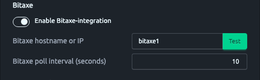

Bitaxe is an open-source ASIC miner using the BM1366/BM1368/BM1370
chip. The firmware connects via HTTP and pulls the AxeOS API:

- **Bitaxe enabled** — master toggle. Off = no Bitaxe screens, no
  polling.
- **Bitaxe hostname** — LAN hostname or IP of your miner (e.g.
  `bitaxe1.local` or `192.168.20.50`). Default `bitaxe1`.
- **Bitaxe poll seconds** — HTTP poll cadence. Range 5..300, default
  10. Be considerate to the AxeOS HTTP server.

The two Bitaxe screens — hashrate and best difficulty — appear in the
rotation only when `bitaxeEnabled=true`.

## 9. Nostr zap setup

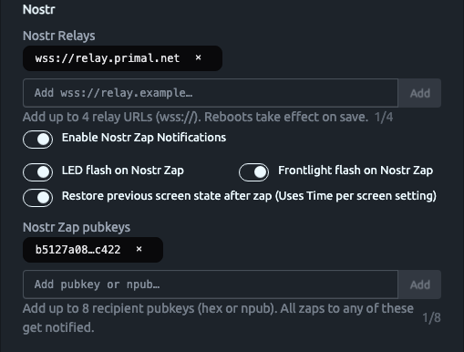

Nostr support has two facets: a *data source* (BTClock can pull block /
price data over Nostr from a `kind 30078` long-form event) and a *zap
listener* (NIP-57 zap-receipts trigger the on-screen zap overlay,
LEDs, and frontlight flash).

**Listening for zaps** doesn't require flipping `dataSource` to Nostr;
the zap listener lives independently:

| Setting | Description |
|---|---|
| `nostrRelay` | Relay URL (`wss://...`). Used for both the data source and the zap listener. |
| `nostrPubKey` | Author pubkey the data-source listener follows (only relevant when `dataSource=2`). |
| `nostrZapNotify` | Master toggle for zap pop-ups. |
| `nostrZapPubkey` | Pubkey whose zaps trigger the overlay. |
| `scrnRestoreZap` | After the zap overlay times out, restore the previous screen. |

Every incoming event — both kind 30078 (NIP-78 data) and kind 9735
(zap receipt) — is BIP-340 schnorr-verified against the recomputed
canonical id before any side effect (LED flash, overlay, snapshot
update). The verifier is the vendored libsecp256k1 in
`components/secp256k1/`; relay-forged frames are dropped with a
`drop unverified ...` warn log.

For a dev-mode test of the zap pipeline without a real relay event:

```bash
curl -X POST http://btclock-xxxxxx.local/api/action/simulate_zap
```

Fires the same code path as a real `kind 9735` arrival (LEDs flash,
frontlight pulses, zap screen overlays).

## 10. LEDs & frontlight

Both the rear LED strip (all variants) and the frontlight (Rev B
only) are configured from **Settings → Displays and LEDs**:

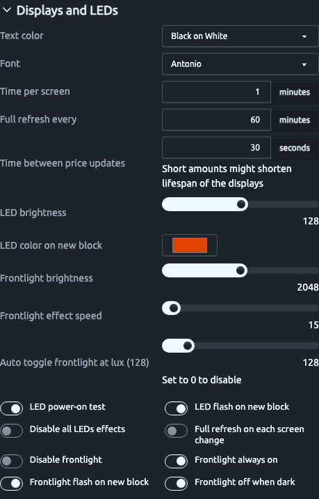

The colour swatch + "Flash" button on the **Control** card drive the
LED strip live; everything below changes the *defaults* the firmware
applies.

### LED strip (NeoPixel, all variants)

The strip ships pre-mounted along the back/top of the enclosure and
defaults to BTClock orange (`#E04300`) flashing on every new block.

| WebUI control | Effect | NVS key |
|---|---|---|
| **LED brightness** slider | NeoPixel master brightness 0..255. | `ledBrightness` |
| **LED color on new block** swatch | The colour the strip pulses on a new block. Click to open the colour picker. | `blockFlashColor` |
| **LED power-on test** | Run the rainbow boot test. Off → strip goes straight to idle. | `ledTestOnPower` |
| **LED flash on new block** | Per-block pulse; off if you find it distracting. | (always on; controlled by `disableLeds`) |
| **Disable all LED effects** | Master mute. Combined with frontlight off, the device emits no visible light. | `disableLeds` |

For ad-hoc colours from a script:

```bash
# Set the whole strip orange
curl -X POST 'http://btclock-xxxxxx.local/api/lights/color?c=E04300'
# Mute the strip
curl -X POST http://btclock-xxxxxx.local/api/lights/off
```

#### LED status effects

The strip is also a status indicator. Beyond the block-flash pulse it
plays a handful of patterns to communicate device state — useful when
the panels can't (during boot, while connecting, when an upstream
data feed drops). They're all suppressed when **Disable all LED
effects** is on or DND is active.

| Pattern | Meaning | What to do |
|---|---|---|
| Rainbow scan, ~1.5 s, then off | Power-on self-test. | Nothing — boot is in progress. (Toggle **LED power-on test** off to skip it.) |
| Single cyan pixel sweeping along the strip, continuous | Connecting to WiFi. | Wait. Long sweeps point at a slow AP or a weak signal. |
| Triple green flash | WiFi connected, IP obtained. | Nothing — fires once after the spinner clears. |
| Red ↔ blue alternating, three quick flashes | Saved WiFi credentials kept failing — device is rebooting into provisioning. | Reconnect to the `BTClock-XXXX` SoftAP and submit fresh credentials. |
| Soft cyan breathing, continuous | Provisioning portal active (SoftAP / captive-portal mode). | Connect to the BTClock's hotspot and finish setup — see [§2 Hardware tour](#2-hardware-tour) and [§4 WebUI tour](#4-webui-tour). |
| Quick orange (or your chosen colour) pulse | A new Bitcoin block arrived. | Nothing. Toggle **LED flash on new block** off to silence it. |
| Quick bright pulse | Nostr zap received (when LED flash on zap is enabled). | Background — see [§9 Nostr zap setup](#9-nostr-zap-setup). |
| Slow red breath, ~2 s, repeating every ~5 s | WiFi has dropped, **or** both upstream data feeds are stalled. | Check your WiFi router and the device's RSSI in [§4.2 Status card](#42-status-card-centre). |
| Two quick purple blinks every ~10 s | Block-source feed (Mempool) is stalled but WiFi is fine. | Usually self-recovers. The Status card's "Blocks" badge tells the same story. |
| Two quick amber blinks every ~10 s | Price-source feed (Kraken) is stalled but WiFi is fine. | Usually self-recovers. Mirrored in the Status card's "Price" badge. |
| Yellow-green blink | A data refresh just landed (any source). | Disable via **LED flash on update** if you find it distracting (`ledFlashOnUpd`). |
| Amber sweep ending in red brake-light | Screen rotation paused (front button held, or `/api/pause` called). | Press the front button again to resume — see [§3 On-device controls](#3-on-device-controls). |
| Red handbrake → green sweep | Screen rotation resumed. | Background. |
| All pixels solid red | Boot sanity failure. | Reflash via the [Web flasher](#14-web-flasher) — the firmware never made it to a usable state. |

The fault indicators (red breath / purple / amber blinks) only fire
*between* user-set colours rather than overwriting them — the strip
returns to whatever you last set via the colour swatch or
`/api/lights/color` between pulses, so a static colour is still
visible most of the time.

### Frontlight (Rev B only)

A row of soft-white LEDs aimed across the panel faces, driven by a
PCA9685 16-channel PWM at I²C address 0x40. Without it, the panels
are invisible in the dark. The card is **capability-gated** —
hidden on Rev A and V8 (no PWM channel wired).

| WebUI control | Effect | NVS key |
|---|---|---|
| **Frontlight brightness** slider | Live PWM duty for the brightness slider; commits to NVS on Save. | (live preview; persisted via `flMaxBrightness`) |
| **Frontlight always on** | Bypass the ambient-driven dimming. Easiest if your BTClock always sits in a lit room. | `flAlwaysOn` |
| **Frontlight off when dark** | Turn the frontlight off below `luxLightToggle` lux. | `flOffWhenDark` |
| **Auto toggle frontlight at lux** | The lux threshold that flips between "room bright" and "room dim". Hysteresis is ±1 lux. Set to 0 to disable the auto-off. | `luxLightToggle` |
| **Frontlight effect speed** | Fade-step time in ms (default 15 ≈ 225 ms full fade). | `flEffectDelay` |
| **Frontlight flash on new block** | Extra brief pulse (~150 ms) on each new block. | `flFlashOnUpd` |
| **Disable frontlight** | Master mute. | `flDisable` |

For a bedroom: set **Off when dark = ON** and **Lux threshold = 2** —
the frontlight goes off the moment you turn off the bedroom light.

### Live control via the API

```bash
# Force the frontlight on / off / single flash
curl -X POST http://btclock-xxxxxx.local/api/frontlight/on
curl -X POST http://btclock-xxxxxx.local/api/frontlight/off
curl -X POST http://btclock-xxxxxx.local/api/frontlight/flash
```

## 11. Do Not Disturb

DND is a *light* mute, not a screen blackout — the e-paper still shows
data because it consumes no power to hold an image. DND silences:

- The NeoPixel strip
- The frontlight (Rev B)
- Block / zap flash effects on both

It does NOT pause:

- Screen rotation
- Data source updates
- WebUI / API access

### Manual DND (one click on the Status card)

The **Status** card has a "Do not disturb" pill next to "Screen
cycle":


Click it to mute the LEDs immediately, click again to un-mute. The
toggle applies optimistically — if the API call rejects, the pill
snaps back to server truth and a toast surfaces the error.

### Scheduled DND (Settings → Extra features)

A single nightly window in the local timezone. Overnight windows
wrap (e.g. 22:00 → 07:00 spans midnight). Toggle it on under
**Settings → Extra features**:

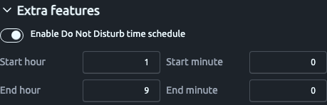

Set `startHour:startMinute` → `endHour:endMinute`, hit **Save**, and
the firmware compares the local clock against the window every tick.
Make sure **Settings → Time zone** matches your locale first — if
DND fires at the wrong time of day, that's the first thing to check.

### Equivalent API

```bash
# Manual on/off
curl -X POST http://btclock-xxxxxx.local/api/dnd/enable
curl -X POST http://btclock-xxxxxx.local/api/dnd/disable

# Read current state
curl http://btclock-xxxxxx.local/api/dnd/status
```

## 12. HTTP API quick reference

Everything in this section has a click-through equivalent in the
WebUI — the API is for scripts, dashboards, and the
[Home Assistant integration](#13-home-assistant-integration). The
full endpoint list with implementation status is in the in-tree
feature-parity matrix on Forgejo at
[`docs/FEATURE_MATRIX.md`](https://git.btclock.dev/btclock/btclock_v4/src/branch/main/docs/FEATURE_MATRIX.md#http--control-api).
Here are the endpoints you'll most often want from a script.

```bash
# What's the device showing right now?
curl http://btclock-xxxxxx.local/api/status

# Push three letters to the panels
curl -X POST 'http://btclock-xxxxxx.local/api/show/text?t=HEY'

# Push a per-panel custom layout
curl -X POST -H 'Content-Type: application/json' \
  -d '{"cells":["1","2","3","4","5","6","7"]}' \
  http://btclock-xxxxxx.local/api/show/custom

# Jump to the BTC ticker
curl -X POST 'http://btclock-xxxxxx.local/api/show/screen?s=20'

# Pause / resume rotation
curl -X POST http://btclock-xxxxxx.local/api/action/pause
curl -X POST http://btclock-xxxxxx.local/api/action/timer_restart

# Set the LED strip to all-orange
curl -X POST 'http://btclock-xxxxxx.local/api/lights/color?c=E04300'

# Trigger a named LED effect (blink / blink_success / blink_error /
# rainbow / breathe / breathe_error / zap / identify / heartbeat /
# off / idle). Effects honour DND, disableLeds, and the global
# suppressor — the call returns 200 even when the effect is muted.
curl -X POST -H 'Content-Type: application/json' \
  -d '{"name":"rainbow"}' \
  http://btclock-xxxxxx.local/api/lights/effect

# Force a full refresh (clears EPD ghosting)
curl -X POST http://btclock-xxxxxx.local/api/full_refresh

# Patch a setting (live)
curl -X PATCH -H 'Content-Type: application/json' \
  -d '{"timePerScreen": 1}' \
  http://btclock-xxxxxx.local/api/settings

# Live SSE event stream (status, screen rotations, lights, DND, …)
curl -N http://btclock-xxxxxx.local/events

# Pull the panic backtrace from the previous run (Rev B / V8 only;
# 404 if there isn't one). Decodes with espcoredump.py:
curl -o dump.elf http://btclock-xxxxxx.local/api/coredump
espcoredump.py info_corefile -c dump.elf build-rev-b/btclock_v4.elf

# Clear the coredump partition once you've decoded it
curl -X DELETE http://btclock-xxxxxx.local/api/coredump
```

When `httpAuthEnabled=true` add `-u user:pass` to every `/api/*` call.

## 13. Home Assistant integration

A custom Home Assistant integration (maintained alongside the firmware,
same author) ships every `/api/settings` entity — mining-pool / font /
currency selectors, Bitaxe & DND switches, LED + frontlight controls,
firmware Update entity, and more — as Home Assistant devices. The full
walkthrough (install, configuration flow, per-section entity catalogue
with screenshots, firmware update flow, services, and auth/discovery
details) lives in [`HOMEASSISTANT.md`](HOMEASSISTANT.md).

Quick start:

1. HACS → Custom repositories → add
   [git.btclock.dev/btclock/homeassistant-btclock](https://git.btclock.dev/btclock/homeassistant-btclock)
   as an Integration → install → restart HA.
2. Settings → Devices & Services → the BTClock should already appear
   under **Discovered** (mDNS auto-detect on `_http._tcp.local.`); if
   not, **Add integration → BTClock** and enter the device's IP.

The integration auto-detects firmware variant (legacy ≤3.3, v3.4, v4)
and gates the v4-only entities accordingly.

## 14. Web flasher

[**web-flasher.btclock.dev**](https://web-flasher.btclock.dev/) — Chrome / Edge / Brave only
(WebSerial is required). Plug the BTClock into your computer over
USB-C, click "Connect", pick the matching board variant (Rev A / Rev
B / V8) and the latest release, and the flasher streams firmware +
LittleFS in one shot. No toolchain, no command-line.

Use this when:

- You're a first-time user just trying the BTClock — don't bother with
  ESP-IDF.
- A bad firmware made the WebUI unreachable (the web flasher uses USB
  so it doesn't need network access).
- You want the latest stable release without clicking through release
  ZIPs and `esptool` invocations.

If you need a development build or a custom variant, see
[`BUILD_FROM_SOURCE.md`](BUILD_FROM_SOURCE.md).

## 15. Firmware updates

Three update paths, in order of convenience:

### Web flasher (USB)

See [Web flasher](#14-web-flasher) above. Reflashes both firmware and
WebUI image in one click. Only works for tagged releases.

### WebUI upload (OTA)

The Control card has a dedicated **Firmware update** card at the
bottom (visible in the [Control card screenshot above](#41-control-card-left)).

1. Open the WebUI, scroll to **Firmware update** at the bottom of the
   Control card.
2. Click **Choose File** under **Firmware file**, pick the
   `btclock_v4.bin` from the release ZIP for your variant
   (Rev A / Rev B / V8).
3. Click **Update firmware**. A progress overlay paints on the panels
   while the upload runs (~15 s for ~1.5 MiB), and the device
   reboots into the new slot once the SHA-256 verifies.
4. To reflash the WebUI bundle the same way, use **WebUI file** →
   **Update WebUI** below it (`storage.bin` from the release ZIP).

The WebUI auto-detects the active hardware variant and surfaces a
warning if the firmware filename doesn't match — so you can't
flash a Rev B `.bin` onto a Rev A board.

Headless equivalent:

```bash
curl -X POST -H 'Content-Type: application/octet-stream' \
  --data-binary @btclock_v4.bin \
  http://btclock-xxxxxx.local/upload/firmware
# WebUI bundle uses /upload/webui with the same body shape.
```

When `otaPass` is set, add `-u user:pass` to either upload (the OTA
password is separate from the HTTP-auth password).

### Factory reset

The bottom of the Control card carries a **Factory reset** button. A
confirmation modal pops; click confirm to wipe NVS (every setting
back to default) and reboot the device straight into the
provisioning AP — same as a fresh-from-the-box first boot.

Use this when:

- You've forgotten the WiFi password and need the AP back to
  re-enter creds,
- You want a clean slate for testing,
- A bad PATCH from a script left the device in an unusable state.

Headless equivalent (the JSON body is mandatory — guards against
accidental wipes from auto-saved curl history):

```bash
curl -X POST -H 'Content-Type: application/json' \
  -d '{"confirm":"factory_reset"}' \
  http://btclock-xxxxxx.local/api/factory_reset
```

## 16. Troubleshooting

| Symptom | What's happening | Fix |
|---|---|---|
| Can't reach the WebUI on `http://btclock-xxxx.local/` or its IP | Your client and the device aren't sharing a layer-2 segment, or the client's traffic is being shipped elsewhere. | Make sure your phone/laptop is on the **same Wi-Fi network** the device joined (not a Guest SSID, not a separate VLAN). **Disable any VPN** on the client — split-tunnel routing usually sends LAN ranges over the tunnel and mDNS broadcasts never reach the device. In your router, **disable "Client / AP / Guest Isolation"** (sometimes labelled "Wireless Isolation" or "AP Isolation") — that setting blocks station-to-station traffic and the device becomes invisible to other clients on the same SSID. mDNS resolution (`*.local`) additionally needs UDP/5353 multicast forwarding to be on. |
| AP won't appear | Booted into STA mode but the credentials are bad. | Wait `wpTimeout` (default 15 min) for the auto-reboot. Or USB-flash and `factory_reset`. |
| WebUI loads but screens are stale | Data source disconnected. | Status card shows "BTClock data-source connection" red — try Settings → Data sources, swap to mempool.space (`dataSource=1`) and restart. |
| Panels show the same content forever | Rotation is paused. | Click "Resume" on the Status card, or press Button-1. |
| "Firmware version different from WebUI" warning | OTA stopped halfway and only reflashed firmware (or WebUI). | Re-flash the missing half (firmware via `/upload/firmware`, WebUI via `/upload/webui`). The Web flasher does both at once. |
| Frontlight stays on with the bedroom dark (Rev B) | `flAlwaysOn=true` or `flOffWhenDark=false`. | Settings → Light & LEDs → Frontlight → Always on = OFF, Off when dark = ON, Lux toggle threshold = 2. |
| Ghost text on panels | Partial-refresh accumulated drift. | "Force full refresh" on the Control card, or wait for the next `fullRefreshMin` tick. |
| OTA fails with "Failed to connect" | USB-JTAG contention with the running firmware. | Hold BOOT, tap RESET, release BOOT to force the bootloader; retry esptool. Or use the OTA path. |
| Buttons feel reversed | The BTClock is mounted upside-down or you're standing on the wrong side. | Settings → Light & LEDs → **Inverse buttons** flips the polarity. |
| "Failed to load WASM module" on `tools/wasm/preview.html` | The WASM bundle hasn't been built yet, or you're opening the file via `file://`. | Run `tools/wasm/build.sh`, then serve the directory: `python3 -m http.server 8000 --directory tools/wasm`. |
