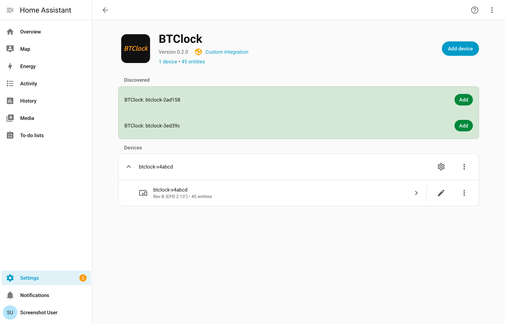
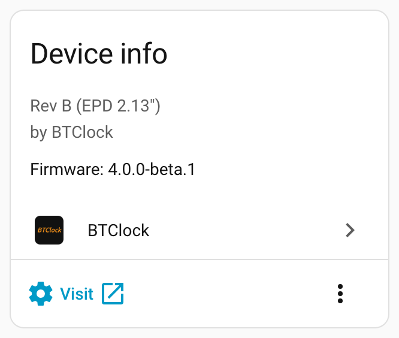
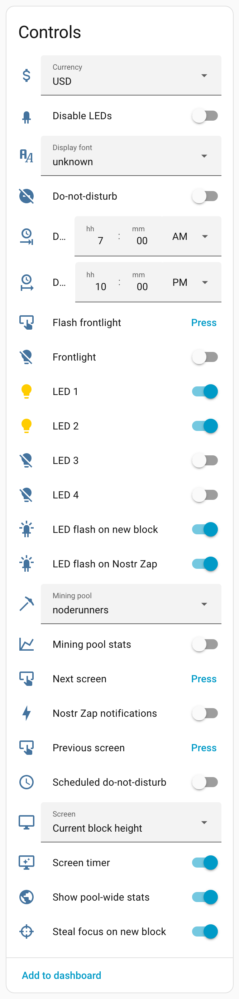
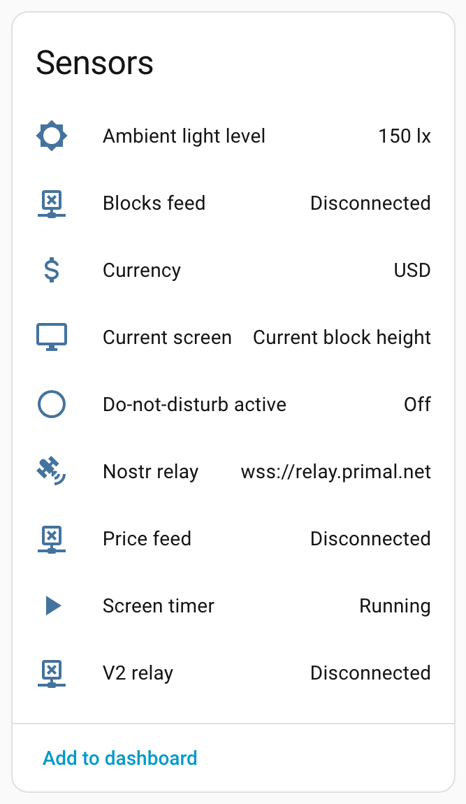
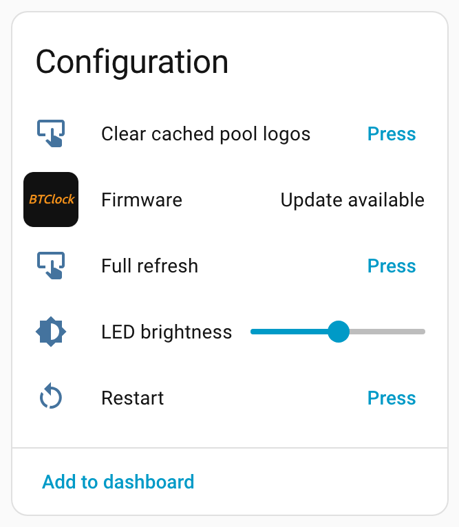
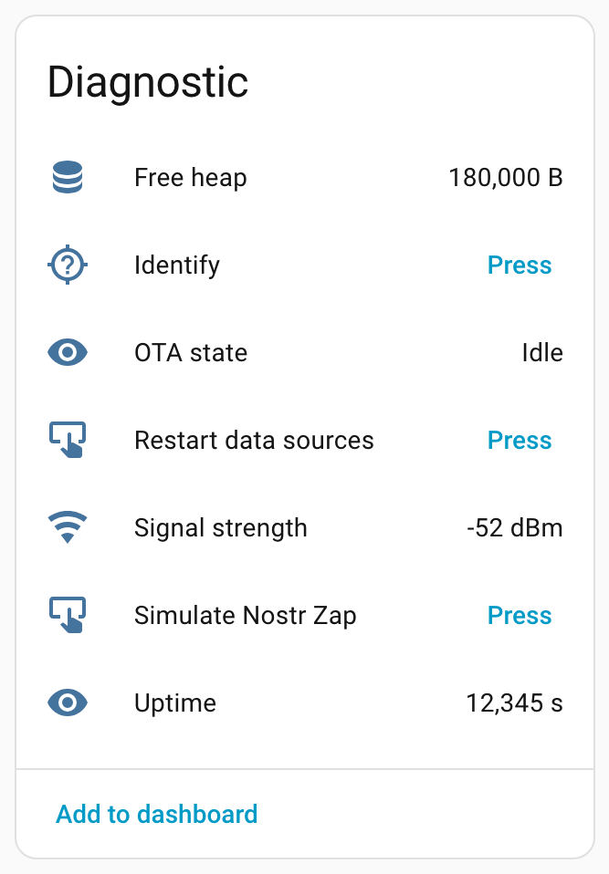
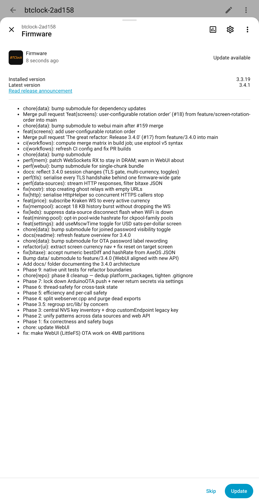

# Home Assistant integration

A custom Home Assistant integration is maintained alongside the
firmware (same author) and published at
[git.btclock.dev/btclock/homeassistant-btclock](https://git.btclock.dev/btclock/homeassistant-btclock)
with a mirror on
[github.com/dsbaars/homeassistant-btclock](https://github.com/dsbaars/homeassistant-btclock).

Install via HACS by adding the repo URL under "Custom repositories" →
integration, restart Home Assistant, then add the BTClock through
**Settings → Devices & Services → Add integration → BTClock**. Devices
on the same multicast domain auto-discover within a few seconds of boot
and appear under "Discovered" — see
[Authentication & discovery](#authentication-discovery) below for
details.

If you're already signed into Home Assistant in this browser, the two
buttons below open the right pages directly — the first adds the
custom repository to HACS in one click, the second jumps straight to
the BTClock integration's "Add integration" flow once it's installed.

The integration auto-detects which firmware generation it's talking to
(legacy ≤3.3, v3.4, v4) and surfaces the appropriate entities. v4-only
features — mining-pool selector, font selector, Bitaxe data source,
pool poll cadences, and the Simulate Zap / Clear pool logos / Restart
data sources actions — only appear on v4 devices, so the device card
matches what your hardware actually supports.

Two update modes ship: **Server-Sent Events** (push, default — the
device streams state changes to Home Assistant in real time) and
**Polling** (configurable interval, for environments where long-lived
HTTP connections aren't viable). Pick during the config flow; switch
later via the integration's Configure dialog.

{ style="max-width:720px" }

> All screenshots in this document are reproducible. The
> [`scripts/screenshot`](https://git.btclock.dev/btclock/homeassistant-btclock/src/branch/main/scripts/screenshot)
> tool in the integration repo boots a temporary Home Assistant against
> a stub BTClock seeded from the v4 fixture, captures the device-card
> sections, and crops them.

## Device card layout

Once added, the BTClock surfaces as a single device with all entities
grouped into Controls / Sensors / Configuration / Diagnostic. The
screenshots below are taken from a Rev B device running v4 firmware
with the BH1750 light sensor and PCA9685 frontlight populated.

### Device info

Hardware revision, firmware version, and a deep-link to the device's
WebUI. The "Visit" button opens the WebUI in a new tab — handy for the
few features the integration doesn't surface, like screen rotation
order and firmware OTA staging (see
[WebUI tour](HANDBOOK.md#4-webui-tour)).

{ style="max-width:480px;max-height:700px" }

### Controls

Day-to-day toggles, selectors, and momentary buttons.

The **Currency picker** switches the active price-feed currency,
affecting the BTC ticker and Sats-per-dollar screens. **Display font**
and **Mining pool** (v4 only) mirror the WebUI's font and pool choosers
— see [Fonts](HANDBOOK.md#6-fonts) and the
[Mining-pool guide](HANDBOOK.md#7-mining-pool-guide) for what each
option does.

**LEDs 1-4** expose each NeoPixel as a separate colour entity, so an
automation can paint individual pixels — e.g. red on a stalled price
feed. Background on the LED strip lives under
[LEDs & frontlight](HANDBOOK.md#10-leds-frontlight); the device also
plays its own indicator patterns for boot / WiFi / data-feed faults
which are catalogued under
[LED status effects](HANDBOOK.md#led-status-effects).

The **Do Not Disturb** start- and end-time fields schedule the
device's nightly quiet window. They mirror the WebUI scheduler —
see [Do Not Disturb](HANDBOOK.md#11-do-not-disturb) for what DND
suppresses.

Momentary buttons cover the rotation controls (next / previous screen,
toggle pause), a global LED-strip toggle, and a reboot.

{ style="max-width:480px;max-height:700px" }

### Sensors

Read-only state.

**Price feed**, **Blocks feed** and **V2 relay** mirror the connection
indicators in the WebUI's
[Status card](HANDBOOK.md#42-status-card-centre), so automations can
react to a stalled feed — for example, notify when the blocks feed has
been disconnected for more than ten minutes.

**Ambient light level** appears on Rev B devices with a populated
BH1750 sensor and reflects the lux value the auto-brightness logic
uses to dim the LEDs and frontlight at night.

**Nostr relay** exposes the configured relay URL as the entity state
and a `connected` boolean as an attribute, so a single template can
pick either. See [Nostr zap setup](HANDBOOK.md#9-nostr-zap-and-wallet-connect-setup) for
what the relay is doing.

{ style="max-width:480px;max-height:700px" }

### Configuration

Settings-card entities and lifecycle actions.

**LED brightness** is the global LED-strip brightness slider — the
same control found in the WebUI's
[Light & LEDs section](HANDBOOK.md#light-leds).

**Firmware** is Home Assistant's standard Update entity. It checks for
new releases once a day and surfaces a one-click install — covered in
detail under [Firmware updates](#firmware-updates) below.

**Clear cached pool logos** (v4 only) wipes the logo cache so the next
mining-pool screen render fetches a fresh copy — useful after pointing
the device at a custom logo URL.

{ style="max-width:480px;max-height:700px" }

### Diagnostic

Health metrics, an identify button, and the v4-only data-source
actions.

**Restart data sources** reconnects the price, blocks, mempool and
Bitaxe feeds without rebooting the device — a softer alternative to a
full reboot when a single upstream feed gets stuck.

**Simulate Nostr Zap** triggers the full zap effect (LED flash plus
on-screen overlay) without needing a real zap. Handy for verifying
[Nostr zap setup](HANDBOOK.md#9-nostr-zap-and-wallet-connect-setup) end-to-end, or for
testing automations that react to the zap event.

**OTA state** is on while a firmware update is downloading or
installing, so automations can suppress notifications during a flash.

{ style="max-width:480px;max-height:700px" }

## Firmware updates

The integration checks the device's release feed once a day. When a
newer firmware is available, the **Firmware** entity in the
Configuration section flips to `Update available` and the device card
shows the standard Home Assistant update prompt.

Clicking it opens the more-info dialog with the installed and latest
versions side by side, the release notes (or a synthesized changelog
when the upstream release has no body), and an **Install** button. The
update itself is handed off to the device's own over-the-air updater
— no need to keep Home Assistant in the loop while the firmware
downloads.

{ style="max-width:380px;max-height:700px" }

For downgrades or pinning to a specific version, the dialog's overflow
menu offers a version picker. The integration streams the chosen
firmware and WebUI assets through Home Assistant and pushes them to
the device, then waits quietly until it reboots onto the new version
and refreshes the entity list to match the new firmware generation
(legacy ↔ v3.4 ↔ v4).

For a deeper look at the update mechanics or the USB / WebUI flashing
alternatives, see [Firmware updates](HANDBOOK.md#15-firmware-updates).

Development builds — anything not on a release tag — are skipped, so a
bench device you're actively flashing won't surface bogus update
prompts. Tagged prereleases (e.g. `4.0.0-beta.1`) are eligible.

## Services

Two domain-level services, callable on both v3.4 and v4:

- **`btclock.show_text`** — display a short message across the panels,
  one UTF-8 codepoint per panel. Truncated to fit the number of panels;
  case is preserved (bundled fonts include lowercase ASCII). Same feature
  as the WebUI's [Control card](HANDBOOK.md#41-control-card-left) text
  input.
- **`btclock.show_custom`** — display one string per panel, for
  layouts the single-character form can't express.

Every `button` entity exposed by the device is also callable from
automations via `button.press` — handy for wiring a physical Zigbee or
Z-Wave remote to actions like "next screen" or "toggle pause".

## Authentication & discovery

If you've enabled HTTP authentication on the device (Settings card →
HTTP auth / OTA — see
[HANDBOOK §4.3](HANDBOOK.md#43-settings-card-right)), the config flow
asks for the username and password on first contact. Credentials are
stored in the integration entry and Home Assistant will prompt for new
ones automatically if you ever change them on the device.

Auto-discovery relies on the device's mDNS broadcast — every BTClock
advertises itself as `btclock-<id>.local` on the local network. The
integration verifies each candidate before adding it, so unrelated
HTTP devices on the same network won't get picked up by mistake.
